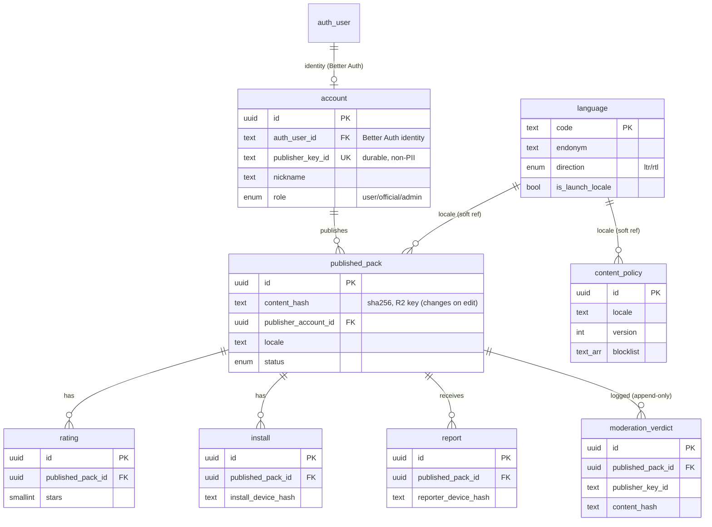

# Alias Backend — Database Architecture (Postgres 17 + Drizzle)

The relational data model for the Alias backend: tables, columns, relations, constraints, indexes, and the lifecycle invariants that govern them. This elaborates [`backend-architecture.md` §D7](backend-architecture.md) (and §D5/§D6/§D8) and aligns with the data model in [`../Alias-V2/alias-game-requirements-v2.md` §5](../Alias-V2/alias-game-requirements-v2.md) and the wire shapes in [`../contracts/`](../contracts/).

> **Status (2026-06-04) — designed, not yet authored.** DB *tooling* is in place (Drizzle + drizzle-kit + a lazy `pg` client + docker-compose Postgres + a `seed.ts` stub), but the schema barrel [`src/db/schema/index.ts`](src/db/schema/index.ts) is intentionally **empty** (`npm run db:generate` reports 0 tables). **This document is the design for the immediate next pass** that authors these tables + the first migration. The endpoints that *mutate* most tables stay deferred seams — only `content_policy` is read by firm-v2 code.

> **The overriding rule still holds:** none of this is on the critical path of gameplay. The DB is **write-only relative to the device** and **connectionless to a running game**. A fresh install plays in airplane mode with the bundled starter pack and an empty/dark database.

---

## 1. Engine, conventions & extensions

- **Postgres 17 + Drizzle ORM + drizzle-kit.** One boring, debuggable engine for accounts, immutable published packs, counters, moderation, and Discover search. **No pgvector** until trigram/string matching demonstrably misses paraphrases.
- **Migrations:** authored via `npm run db:generate` (drizzle-kit emits SQL into [`src/db/migrations/`](src/db/migrations/)) then `npm run db:migrate`. **Never `drizzle-kit push` to a shared DB** — generate + migrate so dev DBs don't drift from the immutable-record schema.
- **Extensions:** `pg_trgm` (fuzzy Discover / the "Harry Poter" case), optionally `citext` (case-insensitive nickname). **Not** `pgvector` (deferred).
- **Conventions:**
  - `snake_case` table + column names; tables singular (`published_pack`, not `published_packs`).
  - Surrogate PK `id uuid default gen_random_uuid()` on app-domain rows; natural keys carry their own `UNIQUE`.
  - Timestamps are `timestamptz`: `created_at not null default now()`, `updated_at` where rows mutate. (The wire/client model uses epoch-ms numbers; serialize at the edge.)
  - Enumerations are Postgres `pgEnum` (listed in [§4](#4-enumerations)).
  - Counters (`install_count`, `rating_avg`, `report_count`) are **denormalized caches** — authoritative truth is the child rows; they are recomputable.
  - **Persisted records carry `schema_version`** where they migrate independently (mirrors the client's migration-ladder invariant).

---

## 2. What lives where (the storage boundary)

Postgres is only one of four stores. Keeping this boundary crisp is what keeps the backend off the gameplay path.

| Store | Holds | Notably **not** here |
| --- | --- | --- |
| **Postgres 17** (this doc) | accounts/creators, published-pack **metadata** + counters, ratings, installs, reports, moderation verdicts, content-policy source-of-truth, language catalog | pack **card content**; spend/rate counters; any device game state |
| **Upstash Redis** | spend cap + rate-limit counters (per-token daily, per-IP daily, global monthly), via **hard Lua reservation** | anything durable/relational |
| **Cloudflare R2 + CDN** | immutable content-addressed pack blobs `packs/{contentHash}.json.gz`; OTA policy `policy/{locale}/v{N}.json` + mutable `policy/{locale}/latest.json` pointer | searchable/sortable data, counters, moderation status (those are API+DB) |
| **On-device** (AsyncStorage/MMKV/`expo-sqlite`, `expo-secure-store`) | `GameSession`, `Settings`, `Stats`, the playable word **corpus**, auth token | nothing server-authoritative for the core game |

**Cards are not in Postgres.** A published pack's words live in the immutable R2 blob keyed by `content_hash`; Postgres stores only metadata + counters + the search vector + the R2 key. This gives free global dedupe and immutability (identical content = identical key), and old installs never break when a new revision is published.

---

## 3. Entity-relationship overview



**Core relations**
- A **creator** (`account`) owns the **identity** in Better Auth (`auth_user_id` FK) and publishes many **`published_pack`** rows (`publisher_account_id`).
- Each **`published_pack`** is **one row per pack** (so `id` is the pack identity); it gathers many **`rating`**, **`install`**, **`report`**, and **`moderation_verdict`** rows — all FK cleanly to `published_pack.id`.
- `published_pack.locale` and `content_policy.locale` reference the dynamic **`language`** catalog by BCP-47 code (soft reference — word languages are server-driven).

---

## 4. Enumerations

Defined once as `pgEnum`, shared by the columns below (names mirror the contracts / spec §5):

| Enum | Values |
| --- | --- |
| `account_status` | `active`, `suspended`, `deleted` |
| `account_role` | `user`, `official`, `admin` |
| `content_rating` | `standard`, `adult` *(18+; the `kids` tier was removed)* |
| `pack_source` | `builtin`, `custom`, `ai` |
| `publish_status` | `pending`, `listed`, `held`, `takenDown` |
| `moderation_decision` | `approved`, `held`, `rejected` |
| `moderation_actor` | `auto`, `human` |
| `report_reason` | `ip`, `adult`, `spam`, `quality`, `other` |
| `report_status` | `open`, `reviewing`, `actioned`, `dismissed` |
| `text_direction` | `ltr`, `rtl` |

> **IP/rights is no longer a per-pack enum.** It lives in the moderation layer — `report_reason: ip` (user reports) + `moderation_verdict.ip_flags[]` (classifier matches) + `held`/`takenDown` status. This matches the spec, which models IP only *inside* the moderation verdict, never as a top-level pack column.

> **`pack_source` is server origin only.** The client's `Pack.source` is a separate, broader enum (`builtin`, `custom`, `ai`, **`downloaded`**, **`imported`**) describing how a *device* acquired its local copy — `downloaded`/`imported` are never stored server-side. `source` isn't a wire field, so the two enums legitimately differ.

---

## 5. Tables (app-domain)

### 5.1 `account` — creator (the only PII surface)
The app-domain creator row. **Identity (email/password) lives in Better Auth** ([§6](#6-better-auth-managed-tables)); this row does **not** duplicate it — it links via `auth_user_id` and adds the publishing-domain attributes.

| Column | Type | Constraints | Notes |
| --- | --- | --- | --- |
| `id` | `uuid` | PK, `default gen_random_uuid()` | |
| `auth_user_id` | `text` | NOT NULL, UNIQUE, FK → `user.id` | the Better Auth identity owner |
| `publisher_key_id` | `text` | NOT NULL, UNIQUE | **durable, non-PII** handle; survives account deletion; used by `published_pack` + `moderation_verdict` for repeat-infringer linkage |
| `nickname` | `text` | NOT NULL | creator display name; profanity-checked; shown on published packs. **Not unique** — duplicates allowed (identity is `id` / `publisher_key_id`) |
| `avatar_emoji` | `text` | | |
| `role` | `account_role` | NOT NULL, `default 'user'` | `official` = first-party publisher (its uploads stamp `published_pack.source = builtin`); `admin` = moderation staff (→ `moderation_verdict.reviewer_id`) |
| `status` | `account_status` | NOT NULL, `default 'active'` | `active` \| `suspended` (repeat-infringer / DMCA ban) \| `deleted` (PII-erased) |
| `created_at` | `timestamptz` | NOT NULL, `default now()` | "member since" |
| `updated_at` | `timestamptz` | | bumped on nickname / avatar / role / status change |
| `deleted_at` | `timestamptz` | | set when PII is erased (attribution anonymized; evidence retained elsewhere) |

> **Creator stats are derived, not stored here.** The Profile screen's `packsPublished` / `totalInstalls` / `avgRating` (spec `CreatorProfile`) are computed from this account's `published_pack` rows at read time — *not* cached columns on `account` (add a read-cache only if that query gets hot). **Identity note:** email/password live in **Better Auth** (linked via `auth_user_id`); this table owns no PII beyond `nickname` / `avatar_emoji`.

### 5.2 `published_pack` — immutable published-pack record
Metadata for a published pack — **one row per pack** (mutable). Editing the words bumps `updated_at` and produces a new `content_hash`; there is **no version history**. **Words live in R2**, not here; this row points at them. Because content is mutable, **editing re-enters moderation** (see [§8](#8-integrity--lifecycle-invariants)) — that single rule closes the publish-then-swap hole without version tables.

This table holds **both** community-published packs **and** the first-party *"official" standard packs* (the normal play content, published under an official account). The app's bundled **starter pack** is the *only* standard content not sourced here — it ships inside the binary as an offline seed, though the same pack also exists here as a catalog row (so it's OTA-supersedable). First-launch onboarding downloads official packs from this catalog (+ R2); see [§10](#10-build-order--deferral-map).

| Column | Type | Constraints | Notes |
| --- | --- | --- | --- |
| `id` | `uuid` | PK, `default gen_random_uuid()` | **the pack identity** (one row per pack) |
| `publisher_account_id` | `uuid` | FK → `account.id`, `ON DELETE SET NULL` | nulled on PII erase (record survives) |
| `publisher_key_id` | `text` | NOT NULL | denormalized durable handle (evidence anchor) |
| `title` | `text` | NOT NULL | |
| `description` | `text` | | |
| `cover_emoji` | `text` | | |
| `locale` | `text` | NOT NULL | BCP-47; drives the `search_vector` regconfig |
| `content_rating` | `content_rating` | NOT NULL, `default 'standard'` | |
| `tags` | `text[]` | NOT NULL, `default '{}'` | creator/curator filter tags (e.g. `party`, `hard`, `90s`); **GIN-indexed** for Discover (`tags @> '{…}'`) |
| `source` | `pack_source` | NOT NULL | origin: `builtin` (official/first-party — from an `official`-role account) · `custom` · `ai` |
| `status` | `publish_status` | NOT NULL, `default 'pending'` | distribution state; fail-closed; **an edit resets it to `pending`** (see §8) |
| `content_hash` | `text` | NOT NULL, INDEX | sha256 of normalized words; R2 key; integrity + "update available" diff. **Changes on every edit**; *not* UNIQUE (two packs may coincidentally share content) |
| `words_count` | `int` | NOT NULL | number of words (denormalized — words live in R2) |
| `r2_key` | `text` | NOT NULL | `packs/{content_hash}.json.gz` |
| `install_count` | `int` | NOT NULL, `default 0` | cache of `install` rows |
| `rating_avg` | `numeric(2,1)` | NOT NULL, `default 0` | cache; 0.0–5.0 |
| `rating_count` | `int` | NOT NULL, `default 0` | cache |
| `report_count` | `int` | NOT NULL, `default 0` | cache of `report` rows |
| `ai_meta` | `jsonb` | | `{ themePromptHash, model, provider, generatedAt, properNounsAllowed }` |
| `search_vector` | `tsvector` | GENERATED (per-locale regconfig) | Discover full-text (see §7) |
| `schema_version` | `int` | NOT NULL | record/format migration ladder (≠ content edits) |
| `created_at` | `timestamptz` | NOT NULL, `default now()` | |
| `updated_at` | `timestamptz` | | bumped on any edit (the "updated" date users see) |

The trust **badge** (official / ai / verified / unreviewed) is **derived** at the catalog API from `source` + publisher `role` + the latest `moderation_verdict` — there is no stored `qa_status` column.

**Constraints:** none beyond the PK. `content_hash` is a **plain index** (integrity + update-diff; blob dedupe happens at the R2 layer), **not** unique.

```ts
// Drizzle sketch (intended style for src/db/schema/published-pack.ts)
export const publishedPack = pgTable('published_pack', {
  id: uuid('id').primaryKey().defaultRandom(),
  publisherAccountId: uuid('publisher_account_id').references(() => account.id, { onDelete: 'set null' }),
  publisherKeyId: text('publisher_key_id').notNull(),
  title: text('title').notNull(),
  locale: text('locale').notNull(),
  source: packSource('source').notNull(),
  status: publishStatus('status').notNull().default('pending'),
  tags: text('tags').array().notNull().default([]),
  contentHash: text('content_hash').notNull(),     // changes on every edit
  wordsCount: integer('words_count').notNull(),
  r2Key: text('r2_key').notNull(),
  updatedAt: timestamp('updated_at', { withTimezone: true }),
  // …counters, ai_meta jsonb, search_vector tsvector, created_at…
}, (t) => ({
  hashIdx: index('published_pack_hash_idx').on(t.contentHash),
  searchIdx: index('published_pack_search_idx').using('gin', t.searchVector),
  tagsIdx: index('published_pack_tags_idx').using('gin', t.tags),
  trgmTitleIdx: index('published_pack_title_trgm_idx').using('gin', sql`${t.title} gin_trgm_ops`),
  statusLocaleIdx: index('published_pack_status_locale_idx').on(t.status, t.locale),
}));
```

**Publish gate (rules to list a pack publicly).** Local *save* has no minimum; *publishing* must pass **all** of:
- **Account:** signed in, `status = active` (not `suspended`), passes attestation.
- **Size:** `words_count` ≥ `MIN_PUBLISH_WORDS` (≈ 20) and ≤ `MAX_PACK_WORDS` (≈ 1000).
- **Metadata:** non-empty `title` (≤ ~60 chars), `locale` + `content_rating` set; `title`/`description` pass the profanity check.
- **Validity:** no duplicate words within the pack; each word's Taboo list (if present) must not contain the word or a substring of it.
- **Moderation:** passes the automated pre-publish scan (**fail-CLOSED**) → `status: pending → listed`.
- **Anti-spam:** per-account publish rate limit (≈ N/day).
- **On edit:** any content change re-runs this gate (`status → pending`).

### 5.3 `rating` — per-device pack rating
Anonymous (no account needed to rate, mirroring installs).

| Column | Type | Constraints | Notes |
| --- | --- | --- | --- |
| `id` | `uuid` | PK | |
| `published_pack_id` | `uuid` | NOT NULL, FK → `published_pack.id` | the pack |
| `rater_device_hash` | `text` | NOT NULL | **per-pack HMAC** — stable per device+pack (so the UNIQUE dedupes), unlinkable across packs; same scheme as `report` |
| `stars` | `smallint` | NOT NULL, `CHECK (stars BETWEEN 1 AND 5)` | |
| `created_at` | `timestamptz` | NOT NULL, `default now()` | first rated |
| `updated_at` | `timestamptz` | | bumped when a device re-rates (UPSERT) |

**Constraints:** `UNIQUE(published_pack_id, rater_device_hash)` — one rating per device per pack; re-rating **UPSERTs** the row (updates `stars` + `updated_at`). **Stars only — no free-text reviews** (deliberately avoids an extra moderation/abuse surface). Feeds `published_pack.rating_avg`/`rating_count`.

### 5.4 `install` — install/download event
Drives `install_count`; anonymous.

| Column | Type | Constraints | Notes |
| --- | --- | --- | --- |
| `id` | `uuid` | PK | |
| `published_pack_id` | `uuid` | NOT NULL, FK → `published_pack.id` | the pack |
| `install_device_hash` | `text` | NOT NULL | **per-pack HMAC** (stable per device+pack; unlinkable across packs — same scheme as `rating`/`report`) |
| `installed_at` | `timestamptz` | NOT NULL, `default now()` | |

**Constraints:** `UNIQUE(published_pack_id, install_device_hash)` — one row per device per pack. So `install_count` is **cumulative distinct devices, monotonic** — uninstalls can't be detected offline, so it never decrements (it's *not* "currently installed"). *(Inflation via reinstall + unbounded row growth are catalog-era hardening — deferred.)*

### 5.5 `report` — in-app abuse report (triage)
Anonymous in-app "Report this pack" submissions — a **triage signal** that feeds the moderation queue. This is **not** the formal legal DMCA channel: a formal DMCA notice needs an identifiable complainant + contact and comes through the Settings *"Report a problem / DMCA"* link (email/web form), landing in the moderation / takedown evidence — not this table.

| Column | Type | Constraints | Notes |
| --- | --- | --- | --- |
| `id` | `uuid` | PK | |
| `published_pack_id` | `uuid` | NOT NULL, FK → `published_pack.id` | the reported pack |
| `reason_code` | `report_reason` | NOT NULL | |
| `reporter_device_hash` | `text` | NOT NULL | **salted, per-pack HMAC** — a device reporting two packs is **not** linkable across packs (D8 privacy invariant) |
| `details` | `text` | | optional free text; **moderator-only** — never shown publicly |
| `status` | `report_status` | NOT NULL, `default 'open'` | |
| `created_at` | `timestamptz` | NOT NULL, `default now()` | |

**Constraints:** `UNIQUE(published_pack_id, reporter_device_hash)` — one report per device per pack. **Auto-hold:** when `report_count` crosses a threshold (lower for `ip` / `adult`), the pack auto-flips to `status = held` pending human review (fail-closed-leaning). Feeds `report_count` + the moderation queue.

### 5.6 `moderation_verdict` — append-only verdict & takedown-evidence log
**Append-only** (no `UPDATE`/`DELETE`; revoke those grants). The latest row per pack = current verdict. This is also the **legal/takedown evidence** record: it retains `publisher_key_id` + `content_hash` so repeat-infringer history survives account deletion.

| Column | Type | Constraints | Notes |
| --- | --- | --- | --- |
| `id` | `uuid` | PK | |
| `published_pack_id` | `uuid` | NOT NULL, FK → `published_pack.id` | the moderated pack |
| `verdict` | `moderation_decision` | NOT NULL | `approved`/`held`/`rejected` (set by `auto` *or* `human` — see `decided_by`) |
| `classifier_flags` | `jsonb` | NOT NULL, `default '[]'` | `[{ classifier, label, score }]` |
| `ip_flags` | `text[]` | NOT NULL, `default '{}'` | IP-rights classifier matches (the primary IP signal — there is no per-pack `ip_flag`) |
| `decided_by` | `moderation_actor` | NOT NULL | `auto` \| `human` |
| `reviewer_id` | `uuid` | FK → `account.id` | the `admin`-role account who decided; set only when `decided_by = human` |
| `notes` | `text` | | |
| `content_hash` | `text` | NOT NULL | the exact content reviewed — **dual role:** legal evidence anchor **and** the "approved hash" for re-moderate-on-edit (if the pack's live `content_hash` drifts from the latest `approved` verdict's, the pack is treated as unreviewed) |
| `publisher_key_id` | `text` | NOT NULL | durable, non-PII; repeat-infringer linkage |
| `created_at` | `timestamptz` | NOT NULL, `default now()` | |

### 5.7 `content_policy` — OTA content-policy source of truth
The authoring source for the per-locale blocklist; **published to R2** (`policy/{locale}/v{N}.json` + `latest.json`) for OTA delivery, and read directly by the server content gate. Blocklist normalization (diacritic fold, bidi/zero-width strip, leetspeak) is *code*; the list is the *data*.

| Column | Type | Constraints | Notes |
| --- | --- | --- | --- |
| `id` | `uuid` | PK | |
| `locale` | `text` | NOT NULL | BCP-47 |
| `version` | `int` | NOT NULL | |
| `blocklist` | `text[]` | NOT NULL, `default '{}'` | |
| `is_latest` | `boolean` | NOT NULL, `default false` | current pointer per locale |
| `created_at` | `timestamptz` | NOT NULL, `default now()` | |

**Constraints:** `UNIQUE(locale, version)`; partial unique `UNIQUE(locale) WHERE is_latest` (exactly one latest per locale).

- **Append-only versions.** A published `v{N}` is immutable (never edit its `blocklist`); a new policy is a new row + an `is_latest` flip. Only the `is_latest` pointer mutates — mirrors the immutable `policy/{locale}/v{N}.json` + mutable `latest.json` on R2.
- **Wire shape = the contract.** What ships (R2 / the `GET /v1/content-policy/:locale` response) is exactly `@alias/contracts` `ContentPolicy { locale, version, blocklist }`; `id` / `is_latest` / `created_at` are server bookkeeping that never cross the wire.
- **A policy is optional per language.** A word language can be offered with **no** `content_policy` row — the gate then falls back to an **empty blocklist (permissive)**. The normalizer (bidi / zero-width / control-char strip) still runs; only the per-locale word list is empty.

### 5.8 `language` — dynamic word-language catalog *(seam)*
Backs the deferred `GET /v1/languages` endpoint and the app's first-run + change-language pickers. New languages added here (or via a future admin panel) appear automatically — the client never hardcodes word languages. *(D7 allows "a table or a constant"; the table is the durable form.)*

| Column | Type | Constraints | Notes |
| --- | --- | --- | --- |
| `code` | `text` | PK | BCP-47 (`en`, `pt-BR`, …) |
| `endonym` | `text` | NOT NULL | native name |
| `display_name` | `text` | NOT NULL | label name |
| `flag` | `text` | | emoji/icon |
| `direction` | `text_direction` | NOT NULL, `default 'ltr'` | text direction for rendering word cards (`rtl` for Arabic/Hebrew); **server-driven** so an RTL language ships without an app update |
| `is_launch_locale` | `boolean` | NOT NULL, `default false` | the reviewed set: en/es/fr/de/pt |
| `enabled` | `boolean` | NOT NULL, `default true` | show in catalog |
| `sort_order` | `int` | NOT NULL, `default 0` | |
| `default_pack_id` | `uuid` | FK → `published_pack.id` | the recommended starter pack to auto-select/download for this language; nullable until one exists. (Overall offline *availability* is derived from `published_pack` rows where `locale = code`.) |
| `created_at` | `timestamptz` | NOT NULL, `default now()` | |

---

## 6. Better Auth (managed) tables

When auth lands, **Better Auth owns its own tables** (`user`, `session`, `account`, `verification`) — generated by its CLI, not hand-authored here. The app-domain `account` ([§5.1](#51-account--creator-the-only-pii-surface)) **links** to `user` via `auth_user_id` rather than duplicating identity columns; email/password/verification live entirely in Better Auth.

> **⚠️ Name collision.** Better Auth's own credentials table is literally named **`account`**, which collides with our app-domain `account`. Resolve by configuring a **Better Auth table prefix** (e.g. `auth_` → `auth_user`, `auth_session`, `auth_account`, `auth_verification`) so the names don't clash. Decide this **before** writing any auth migration. Reconcile the **token mechanism** too (adopt `@better-auth/expo` secure-store session, or keep the manual bearer) before any auth UI.

| Better Auth table | Purpose | Linkage |
| --- | --- | --- |
| `user` | identity (email, emailVerified, name, image) | `account.auth_user_id → user.id` |
| `session` | active sessions/tokens | `→ user.id` |
| `account` (→ `auth_account`) | provider/credential records | `→ user.id` |
| `verification` | email-verification tokens | by identifier |

---

## 7. Indexes & full-text search

- **Discover full-text:** `published_pack.search_vector` is a generated `tsvector` (built from `title` + `description`) whose **`regconfig` is chosen per pack `locale` at write time** (word languages are dynamic; the launch-reviewed set is en/es/fr/de/pt) — **GIN** indexed.
- **Fuzzy match:** `pg_trgm` **GIN** index on `published_pack.title` (handles misspellings like "Harry Poter" at zero marginal cost — the reason pgvector is deferred).
- **Tag filter:** **GIN** index on `published_pack.tags` (`text[]`) for `tags @> '{…}'` Discover filters.
- **Hot lookups:** btree on `published_pack(status, locale)`, `published_pack(publisher_account_id)`, `published_pack(content_hash)`; `report(status)`, `moderation_verdict(publisher_key_id)`, `moderation_verdict(published_pack_id, created_at DESC)` (latest verdict per pack), `install(published_pack_id)`, `rating(published_pack_id)`.
- **Isolation:** all Discover queries go through **one `search` repository module** so a future swap (pgroonga/Typesense for CJK) touches one file.

---

## 8. Integrity & lifecycle invariants

1. **Mutable pack, content-addressed blob.** One row per pack; editing words bumps `updated_at` and the `content_hash` (→ a new R2 blob). `content_hash` gives integrity + "update available" diffs + blob-layer dedupe — it is **not** a uniqueness constraint. A device's downloaded copy is a snapshot and never breaks when the catalog row changes.
2. **Counters are caches.** `install_count` / `rating_avg` / `rating_count` / `report_count` are derived from child rows and are recomputable; never treat them as source of truth.
3. **Moderation fails CLOSED + re-moderate on edit.** A pack stays `pending`/`held` if the classifier is unavailable; only an explicit `approved` verdict can flip `status → listed`. Because content is mutable, **any edit changes `content_hash` and resets `status → pending`** for a re-scan — the verdict stores the approved hash, so if the live hash drifts from it the pack is treated as unreviewed (an `official`/trusted account may auto-pass). Verdicts are append-only.
4. **Privacy by hashing.** `reporter_device_hash` is a **salted per-pack HMAC** (cross-pack-unlinkable); `install`/`rating` device hashes are salted. These tables hold **no PII**. The single PII surface is Better Auth `user` + `account` attribution.
5. **Delete-account = erase PII, retain evidence.** A `beforeDelete`/`afterDelete` cascade anonymizes attribution (`published_pack.publisher_account_id → NULL`, `account` PII cleared / `status = deleted`) **while** `moderation_verdict` (append-only, keyed by `publisher_key_id` + `content_hash`) retains the repeat-infringer/legal record. One transactional delete cascade; the durable `publisher_key_id` is what survives.
6. **One shared normalizer.** The on-device gate and the server publish gate use the *same* normalizer so `content_hash` never drifts and both agree on the blocklist.
7. **Schema versioning.** Records that migrate independently carry `schema_version`; migrations run via drizzle-kit `generate` + `migrate` (never `push` to a shared DB).

---

## 9. Migrations & seeding

- **Generate → migrate:** `npm run db:generate` (SQL into `src/db/migrations/`) → `npm run db:migrate`. Inspect with `npm run db:studio` (Drizzle Studio, `127.0.0.1:4983`) or the Compose **pgweb** service for raw SQL/`EXPLAIN`.
- **Extensions (first migration):** `CREATE EXTENSION IF NOT EXISTS pg_trgm;`. No pgvector (and no `citext` — `nickname` is plain `text` now).
- **Seed (`npm run db:seed`):** the launch-locale `content_policy` rows, the **official standard packs** (incl. the content the app bundles as its starter pack) as first-party `published_pack` rows under an official account, and the `language` catalog (the 5 launch locales). The seed is the only writer of these until admin tooling lands.
- **Per-locale regconfig** must be chosen by pack locale from the **first** migration (dynamic languages) — bake it into the `search_vector` generation expression.

---

## 10. Build order & deferral map

**Author now (next pass) — tables + first migration + seed:**
`content_policy`, `published_pack`, `rating`, `install`, `report`, `moderation_verdict`, `account`, `language`, plus enums, `pg_trgm`, and the per-locale `tsvector`. The model is reviewed and stable from day one.

**Read/used by firm-v2 code now:** only **`content_policy`** (the content gate / OTA policy). Generation itself touches **Redis** (budget) + **R2** (policy/blobs), not these tables.

> **Official standard packs ship sooner than community UGC.** First-launch onboarding **reads** the catalog and **downloads** official standard packs (served from `published_pack` + R2 under an official publisher account), so the catalog *read* / download path is a **v1 onboarding** concern — earlier than the rest of the catalog. The *write* side — community publish, ratings, reports, moderation — stays deferred per the table below. The bundled **starter pack** still guarantees offline-first if onboarding can't reach the network.

**Deferred behind seams (tables exist; endpoints/logic do not):**

| Area | Tables involved | Lights up when |
| --- | --- | --- |
| Publish / Discover / install / rating | `published_pack`, `install`, `rating` (+ `search` repo, pg-boss) | catalog greenlit |
| Reports / moderation queue | `report`, `moderation_verdict` (+ staffed queue, admin panel) | catalog ships (Apple 1.2) |
| Accounts / auth | `account` ↔ Better Auth tables | publishing greenlit |
| Languages endpoint | `language` | first-run/change-language pickers wire up |
| pgvector | — | trigram demonstrably misses paraphrases |

> Budget/rate counters intentionally **never** become tables — they live in Redis (D4). Keep them there even when the DB grows.
