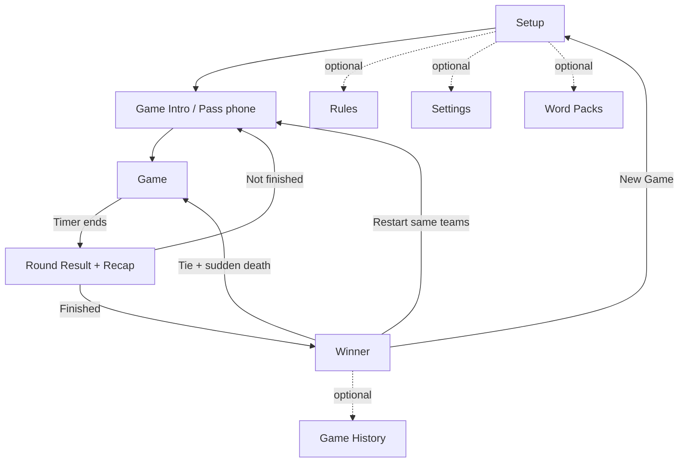

# Alias Game — Product & Screen Requirements (v2)

## Document purpose

This is a detailed product specification for the **Alias** word-guessing mobile game. It covers the game rules, the underlying data model, every screen (purpose, layout, states, interactions, validation, and edge cases), app lifecycle behavior, non-functional requirements, and a set of optional "headline" features.

**Platform & stack constraints (given):**

- React Native with **Expo** (SDK 56+), New Architecture + Hermes on. Routing via **Expo Router** (file-based).
- UI built with **`StyleSheet.create` + theme tokens** (see `src/theme/`), used consistently — no hardcoded colors/spacing in components.
- **Offline-first**: the core game must work with no network connection.
- Single shared device, **pass-and-play** (one phone is passed around the group). Multi-device play is an optional later feature.

> Anything marked **(v1)**, **(v2)**, or **(v3)** indicates phased scope — see [Release roadmap](#release-roadmap). Anything marked **[Optional]** is nice-to-have within its phase.

---

## Table of contents

1. [Game concept](#1-game-concept)
2. [Terminology](#2-terminology)
3. [Game modes](#3-game-modes)
4. [Rules engine](#4-rules-engine) ← the part the original spec was missing
5. [Data model](#5-data-model)
6. [Screen requirements](#6-screen-requirements)
7. [Navigation flow](#7-navigation-flow)
8. [App lifecycle, timer & persistence](#8-app-lifecycle-timer--persistence)
9. [Creative & extraordinary features](#9-creative--extraordinary-features)
10. [Non-functional requirements](#10-non-functional-requirements)
11. [Sound & haptics](#11-sound--haptics)
12. [Word packs & content](#12-word-packs--content)
13. [Edge cases & error handling](#13-edge-cases--error-handling)
14. [Release roadmap](#14-release-roadmap)
15. [Open questions](#15-open-questions)

---

## 1. Game concept

Alias is a team word-guessing party game. On each turn, one player from the active team (the **describer**) sees a word and explains it to their teammates using synonyms, descriptions, and hints — **without saying the word, any part of it, or its direct translation**. Teammates (the **guessers**) try to say the word out loud. The describer marks each word **correct** or **skip** and moves to the next word, racing a countdown timer. Teams take turns; the winner is decided by score or by reaching a target, depending on the mode.

**Design goals**

- Fast, frictionless gameplay — large tap targets, instant word transitions, no fiddly menus mid-round.
- Fair and configurable rules that suit families, parties, and competitive players.
- Robust offline behavior, including a timer that never breaks when the app is interrupted.
- Accessible and localizable from day one.

**Non-goals (for the first version)**

- Online/remote multiplayer (optional v3).
- User accounts / cloud sync (local-only data).
- In-app purchases.

---

## 2. Terminology

| Term | Definition |
| --- | --- |
| **Active team** | The team currently taking its turn. |
| **Describer** | The player holding the device and explaining words. By default this is whoever holds the phone; the team rotates this informally. **[Optional]** track individual players for forced rotation and stats. |
| **Guessers** | The describer's teammates, trying to say the word. |
| **Word card** | A single word to be guessed, optionally with a list of forbidden related words (see [Taboo mode](#describe-modes-v2)). |
| **Round / Turn** | One team's single timed playing period. ("Round" and "turn" are used interchangeably; the UI uses **Round**.) |
| **Rotation** | One full cycle in which every team has played exactly one round. |
| **Round count** *(Time Score mode)* | The number of rounds **each team** plays. Total rounds = `roundCount × teamCount`. |
| **Score delta** | The net points a team gains or loses in a single round. |
| **Word pool** | The set of available words for the current game, drawn from the selected word pack(s). |

---

## 3. Game modes

The user picks one mode per game during Setup.

### 3.1 Time Score mode

- Each team plays a fixed **round count** (rounds per team).
- The game ends when every team has completed all of its rounds (the final rotation is finished).
- **Winner:** the team with the highest total score. A tie is broken by **repeated sudden-death rounds** until a single winner — never a draw (see [tie-break](#46-end-of-game-fairness--tie-breaks)).

### 3.2 Max Score mode

- The game ends when a team reaches or passes the configured **max score**.
- **Fairness option (recommended, configurable):** *Finish the rotation* — when a team hits the target, the current rotation completes so every team has played an equal number of rounds. The highest score after the rotation wins. If disabled, the **first** team to reach the target wins immediately.
- **Winner:** the team at or above the target with the highest score after the equalizing rotation (**"finish the rotation" is the default**). Ties → **repeated sudden-death** until decided (see [tie-break](#46-end-of-game-fairness--tie-breaks)).

### 3.3 Describe modes (v2)

Independent of scoring mode, the group can choose **how** words are conveyed. Default is classic verbal description.

- **Describe** (default) — explain with words, no part of the target allowed.
- **Taboo** — each card lists 3–5 forbidden related words the describer also cannot say (richer, harder).
- **Charades** — act it out, no talking. **[Optional]**
- **One word** — exactly one word per clue.
- **Hum / sing** — for song/movie packs. **[Optional]**

Describe mode affects only how the round is presented; scoring, timer, and flow are unchanged.

### 3.4 Word language (v1) & bilingual mode (v2)

The **word language** (the language of the word cards) is chosen **per game** and is **independent of the app's UI language** — an English-speaking host can run a Spanish game, and vice-versa. See [Internationalization](#10-non-functional-requirements) and the [Setup screen](#61-setup-screen).

- **Single language** (default) — all word cards are drawn in one selected language.
- **Bilingual "Translate-a-pack" mode** *(v2 — signature feature)* — the card shows the word in **language A**, and its **direct translation into language B is the forbidden answer** the guessers must say (or vice-versa). This turns Alias's core "no direct translation" rule into a distinct game mode — ideal for bilingual groups and language learners, and not copyable by other word games. Requires cards that carry a `translations` map (see [Data model](#5-data-model)); enforcement is advisory (the group arbitrates) until on-device speech auto-foul (v3).
- **Word languages are dynamic (server-driven).** The available word languages come from the **backend catalog** — new ones added server-side (DB / a future admin panel) appear automatically — and are **downloaded on demand for offline play**. A **launch set of 5 fully reviewed languages — English, Spanish, French, German, Portuguese** seeds the catalog (the default language ships a small **bundled starter pack** for offline-first; the full standard catalog is downloaded on demand — see [§12](#12-word-packs--content)); the data model, RTL-safe layout, and font pipeline support adding more later (incl. RTL/CJK) without rework. The word language is picked at [first launch](#first-launch-language-onboarding-v1) and per game in Setup — **independent of the app UI language**.

---

## 4. Rules engine

This section defines the authoritative gameplay logic that all screens share.

### 4.1 Turn structure

1. The active team is shown the **Game Intro** (hand-off) screen.
2. On **Start Round**, the timer initializes and the first word is drawn from the pool.
3. The describer marks each word **Correct**, **Skip**, or **Foul** (if enabled); the next word is drawn immediately.
4. The round ends when the timer reaches zero (see [last-word rule](#44-timer--last-word-rule)) or, optionally, when a per-round skip limit forces an end.
5. The **Round Result** screen shows the summary; on **Continue**, the engine decides the next step (next team or Winner) per the active mode.

### 4.2 Scoring

For a single round:

```
roundDelta = (correctCount × correctScore)
           + (skipCount × skipScore)
           + (foulCount × foulScore)      // foul is optional

team.score += roundDelta
```

- `correctScore` is positive (default **+1**).
- `skipScore` is zero or negative (default **0**; common alt **−1**).
- `foulScore` **[Optional]** is zero or negative (default **−1**), applied when the describer breaks a rule.
- **Negative totals:** **allowed** (decided) — a team's total may go negative; there is no clamp-to-zero.
- Scores update **immediately** in the UI on every action.

### 4.3 Word flow & repetition

- Words are drawn from a shuffled pool built from the selected pack(s).
- A word is **never repeated** while unused words remain in the current game.
- If the pool is **exhausted mid-game**, reshuffle all previously used words (excluding the word currently on screen) and continue.
- If a pack is very small, this guarantees play never stalls; show a non-blocking notice in Setup when the pool is unusually small relative to expected length.

### 4.4 Timer & last-word rule

- The timer counts down from `roundDurationSec` to zero and is the single source of round length.
- Configurable **buzzer-beater rule**:
  - **Hard stop** (default) — at zero, the current word is discarded with no points; inputs disable.
  - **Finish the word** — the describer gets one final decision on the word currently on screen after the buzzer, then the round ends.
- Visual + audio + haptic warning during the final 10 and 5 seconds (see [Sound & haptics](#11-sound--haptics)).
- **[Optional]** Pause control mid-round (e.g., interruption); paused time does not count down.

### 4.5 Skips & fouls

- **Skip** advances to the next word and applies `skipScore`.
- **[Optional] Skip limit** per round (`skipLimit`, default unlimited). When reached, the Skip button disables for the rest of the round.
- **[Optional] Foul** button applies `foulScore` and advances — used when the describer says a forbidden word. With **Auto-foul (v3)**, on-device speech recognition can flag the spoken target word automatically.

### 4.6 End-of-game, fairness & tie-breaks

- **Time Score:** game ends after the final rotation completes.
- **Max Score:** game ends when a team hits the target (immediately, or after the equalizing rotation if enabled).
- **Tie-break — no draw.** A tie is **always** broken by **repeated sudden-death extra rounds** until a single winner emerges: tied teams play a short shared-timer round (e.g., 30s each, or a single golden word); the highest delta advances; repeat until the tie is broken. Applies to both Time Score and Max Score.

### 4.7 Describer rotation [Optional, v2]

If individual players per team are tracked, the describer rotates each time the team plays so everyone describes roughly equally. Otherwise the team manages this informally and the app only tracks team-level state.

---

## 5. Data model

A suggested shape for the core entities and persisted session. (Field names are illustrative.)

> **Update (2026-06-04).**
> 1. **Content tiers = `standard | adult`** — the `kids` tier is removed and content **filtering is deferred** to a later phase ([§15.14](#15-open-questions)).
> 2. **Word languages are dynamic** — chosen from the backend's catalog (BCP-47) and downloaded for offline play; the **app UI language is separate** (a bundled launch set). See [first-launch onboarding](#first-launch-language-onboarding-v1).
> 3. **Known data-model gaps to fill during code implementation** (tracked here, modeled later — not added now): a persisted **`Settings`/`AppPreferences`** entity (sound, haptics, theme, `uiLocale`, handedness, default round/scoring, default + downloaded word languages); a persisted **`Stats`** blob; a **`LanguageCatalog`** shape (the dynamic word-language list + per-language offline availability); and the concrete **v1 bundled starter pack** contents (size, difficulty mix, file location, first-run seeding).
> 4. **Pack acquisition model (decided).** The standard words are **packs**, not loose words. A small **bundled starter pack** (default launch language) ships in the binary as the offline safety net; the **full standard catalog** — all languages + themes — is **server-driven and downloaded on demand**, delivered as first-party *"official"* packs through the same catalog + R2 path as community packs. **First launch:** pick ≥1 pack → download → play (offline falls back to the bundled starter). Client/device `source` provenance: `builtin` = bundled starter · `downloaded` = official **and** community installs · `custom`/`ai` = local (optionally published) · `imported` = QR/file (the server `published_pack` catalog enum is only `builtin`/`custom`/`ai`). See [§12](#12-word-packs--content).

```ts
type GameMode = 'time' | 'max';
type DescribeMode = 'describe' | 'taboo' | 'charades' | 'oneWord' | 'hum';
type TieBreak = 'suddenDeath'; // no draw — repeat sudden-death until a winner is decided
type BuzzerRule = 'hardStop' | 'finishWord';

interface GameConfig {
  mode: GameMode;
  describeMode: DescribeMode;       // v2; default 'describe'
  roundDurationSec: number;         // > 0
  correctScore: number;             // != 0, positive
  skipScore: number;                // <= 0
  foulScore?: number;               // <= 0 (optional)
  maxScore?: number;                // required when mode === 'max'
  roundCount?: number;              // required when mode === 'time' (rounds per team)
  skipLimit?: number;               // optional; undefined = unlimited
  allowNegativeTotals: boolean;     // default true
  buzzerRule: BuzzerRule;           // default 'hardStop'
  finishRotationOnMax: boolean;     // Max mode fairness; default true
  tieBreak: TieBreak;
  wordPackIds: string[];            // selected packs; falls back to default
  contentFilter: 'standard' | 'adult'; // 'adult' = 18+. Filtering DEFERRED (later phase); default 'standard'
  wordLocales: string[];            // BCP-47 word language(s) for THIS game, from the backend's DYNAMIC catalog; default = first-run word language. length > 1 ⇒ bilingual. INDEPENDENT of app UI language
  translationFoulEnabled?: boolean; // v2 bilingual; saying the direct translation is a foul (advisory until v3 auto-foul). default true when bilingual
}
// NOTE: the app UI language (`uiLocale`, a Settings concern) is INDEPENDENT of wordLocales above.

interface Team {
  id: string;
  name: string;
  color: string;                    // theme-safe team color
  avatar?: string;                  // optional emoji/icon
  score: number;
  roundsPlayed: number;
  totalCorrect: number;
  totalSkipped: number;
  totalFouls: number;
}

interface RoundResult {
  teamId: string;
  index: number;                    // which round for this team (0-based)
  correctWordIds: string[];
  skippedWordIds: string[];
  fouledWordIds: string[];
  scoreDelta: number;
  durationUsedSec: number;
}

interface WordCard {
  id: string;                       // client-assigned UUID (never set by an AI model)
  word: string;
  packId: string;                   // → owning Pack; the card's language is inherited from Pack.locale
  difficulty: 'easy' | 'medium' | 'hard';  // language-relative; authored/reviewed per locale, never copied across languages
  taboo?: string[];                 // forbidden related words (Taboo mode); authored per locale
  hint?: string;                    // v2; optional gameplay hint (future AI/hint modes) — the slim wire card calls this `h`
  source: 'builtin' | 'custom' | 'ai' | 'imported' | 'downloaded';  // provenance; drives content-filtering, badges, "regenerate but keep my edits"
  translations?: Record<string, string>;   // v2; locale -> direct translation. Powers bilingual mode + the "no direct translation" foul. NOT a locale claim.
}

// v2 — first-class Pack entity (previously packs were referenced only by id). A Pack is SINGLE-LOCALE
// and owns its WordCards; a card's language is inherited from Pack.locale.
interface Pack {
  id: string;                       // UUID
  schemaVersion: number;
  name: string;
  description?: string;
  coverEmoji?: string;
  tags?: string[];                  // filter/Discovery tags (e.g. 'party', 'hard', '90s'); GIN-indexed server-side for Discover
  locale: string;                   // BCP-47; authoritative language for every card
  contentRating: 'standard' | 'adult';            // 'adult' = 18+ (kids tier removed)
  source: 'builtin' | 'custom' | 'ai' | 'imported' | 'downloaded';  // CLIENT device-provenance (how THIS device got the pack); the server catalog enum is only builtin/custom/ai
  qaStatus: 'verified' | 'unreviewed' | 'ai';  // CLIENT display badge, computed by the catalog API (no server column); 'official' derived from source/publisher
  contentHash: string;              // sha256 of normalized words — integrity + "update available" diff; changes on every edit (no version history)
  bundled: boolean;                 // true ONLY for the small starter pack (ships in binary as the offline seed); all other standard packs are downloaded
  authorHandle?: string;            // creator nickname (from the publisher's Account)
  publishable: boolean;             // forced false when rating checks fail (IP is judged server-side at publish, not a client flag)
  publishState?: 'local' | 'published' | 'unpublished';
  aiMeta?: { themePromptHash: string; model: string; provider: string; generatedAt: number; properNounsAllowed: boolean };
  cards: WordCard[];
  createdAt: number;
  updatedAt: number;
}

// PUBLISHING requires a SIMPLE ACCOUNT — the ONLY part of the app that does. The core game,
// local packs, AI generation, and offline (QR/file) sharing never require an account.
interface Account {
  id: string;                       // server-assigned
  nickname: string;                 // creator display name (profanity-checked; shown on published packs)
  email: string;                    // login + DMCA/abuse contact; verified
  // NOTE: email + password are owned by the AUTH LAYER (Better Auth), NOT the server `account` table — linked via auth_user_id, shown masked on Profile (see db-architecture.md §5.1). Password is never stored on device; client keeps only a token.
  avatarEmoji?: string;
  createdAt: number;                // "member since"
}

interface AuthSession {             // local only
  accountId: string;
  token: string;                    // in expo-secure-store; refreshed; cleared on sign-out
}

// Profile/creator stats (server-derived, cached locally) shown on the Profile screen.
interface CreatorProfile {
  account: Account;
  packsPublished: number;
  totalInstalls: number;
  avgRating: number;                // 0–5
  publishedPacks: Array<{
    packId: string; title: string; installs: number; rating: number;
    status: 'published' | 'pending' | 'unpublished' | 'takenDown';
  }>;
}

// Per-locale moderation resource, loaded with that locale's UI strings. Data (OTA-updatable), not code.
interface ContentPolicy {
  locale: string;                   // BCP-47, from the dynamic word-language catalog
  blocklist: string[];              // + normalization: diacritic fold, bidi/zero-width strip, leetspeak
}

interface FeatureFlags {
  aiGenerationEnabled: boolean;
  publicCatalogEnabled: boolean;    // off where a lower age rating is required
}

// Transient client → AI-proxy contract (NOT persisted in GameSession).
interface GenerationRequest {
  theme: string;                    // <= 200 chars; treated as untrusted DATA, not instructions
  count: number;                    // <= 200 (UI default 50)
  locale: string;                   // BCP-47 from the dynamic catalog; generate NATIVELY; never translate-from-English
  contentFilter: 'standard' | 'adult';  // enforcement deferred; default 'standard'
  withTaboo: boolean;               // auto-generate taboo lists (the headline AI feature)
  properNounsAllowed: boolean;
  mode: 'create' | 'expand' | 'replaceWord';
  existingWords?: string[];
}

type GameStatus = 'setup' | 'intro' | 'playing' | 'roundResult' | 'finished';

interface GameSession {
  schemaVersion: number;            // migration ladder — resume-from-kill must survive schema changes
  config: GameConfig;
  teams: Team[];
  rounds: RoundResult[];
  currentTeamIndex: number;
  usedWordIds: string[];
  wordQueue: string[];              // upcoming shuffled word ids
  roundEndTimestamp?: number;       // epoch ms; timer source of truth
  status: GameStatus;
  winnerTeamIds: string[];          // exactly 1 winner (ties broken by sudden-death; no draw)
  createdAt: number;
  updatedAt: number;
}
```

**Offline / online seam (critical).** A pack's *playability must never depend on the network.* Everything playable is materialized into local storage first; the network may only ever **write** packs into local storage (AI generation, downloads, library installs) — it must never gate a running game, pack selection, or word draw. This is a **release gate**: a full game must play in airplane mode on a fresh install with only the bundled **starter** pack.

**Server-side records (publishing tier only — never authoritative on device):** `PublishedPackRecord { id; publisherKeyId; status: 'pending'|'listed'|'held'|'takenDown'; moderation: { verdict; classifierFlags[]; ipFlags[] }; contentHash; wordsCount; installCount; ratingAvg; reportCount; updatedAt }` (one **mutable** row per pack — an edit bumps `contentHash`/`updatedAt` and re-enters moderation; no version history) and `PackReport { id; packId; reasonCode; reporterDeviceHash }` drive the moderation queue and takedown lifecycle.

**Storage tiers.** Small hot state (GameSession resume blob, Settings, Stats) → AsyncStorage/MMKV. The growing word **corpus** (many packs × words, with locale/rating/difficulty filtering and "draw without repeat") → **SQLite (`expo-sqlite`)** once it outgrows a single JSON blob. Device key / publish token → `expo-secure-store`. Every persisted store carries a `schemaVersion` with a migration ladder run on launch; user-authored packs migrate without data loss.

The full `GameSession` is persisted on every meaningful state change so a game can be resumed after the app is closed (see [Persistence](#8-app-lifecycle-timer--persistence)).

---

## 6. Screen requirements

Core screens (first version): **Home → Setup → Game Intro → Game → Round Result → Winner**.
Optional screens: **Rules, Settings, Word Packs/Library, Account & Profile, Stats & Achievements, Game History, Multiplayer Lobby**.

On **first launch**, a quick two-step **language onboarding** (below) precedes Home.

### First-launch language onboarding (v1)

Shown **once on first launch** (re-runnable from [Settings](#66-optional-screens)) — three quick steps before Home. Mockups live in the design gallery ([`design/index.html`](design/index.html) · [`arcade.html`](design/arcade.html) · [`vivid.html`](design/vivid.html), each in its own theme).

**Step 1 — App (UI) language.** "Choose your language." A list of the bundled launch languages (en, es, fr, de, pt) with endonym + flag; the choice sets the app's interface language immediately and is changeable later in Settings. This is the **i18n UI language**, *not* the in-game word language.

**Step 2 — Word language.** "Choose word language." The language the **game words** are drawn in. The list is the backend's **dynamic catalog** (grows over time, beyond the launch set), each row with a **Download for offline play** control (states: *Download + size* → *downloading* → *✓ Available offline*) and the note *"Download the languages you want so you can play offline."* The choice becomes the default play language in [Setup](#61-setup-screen); a different primary (and an optional secondary for [bilingual mode](#34-word-language--bilingual-mode-v2)) can be picked per game from Setup's **Change language** modal.

**Step 3 — Starter packs.** "Choose at least one pack." For the chosen word language, the user picks **one or more standard packs** from the backend catalog (e.g. a *Starter* set plus themes like Animals / Movies), each with a **Download** control; the selection **downloads into local storage** and becomes the default pack selection in [Setup](#61-setup-screen). These are **first-party *"official"* packs** served from the catalog — *not* frozen in the app (see [§12](#12-word-packs--content)). At least one pack is required to finish onboarding.

**Behavior & offline-first.** Selections persist to `Settings` (`uiLocale`, default word language, downloaded languages + packs). Selecting a language/pack never blocks gameplay. A **small bundled starter pack** (the default language) ships inside the app as the offline safety net, so a **fresh airplane-mode install still plays** even before any download. The dynamic catalog, language, and pack downloads require connectivity but degrade gracefully — if the device is offline at first launch, onboarding falls back to the bundled starter and the user downloads more later (show bundled/already-downloaded content; surface a soft notice otherwise).

---

### 6.0 Home / Main Menu Screen (v1)

**Purpose.** Launch screen and hub for everything outside an active game.

**Must show**

- App identity (logo/title) and a large primary **Play** → Setup.
- **Resume game** card when an in-progress session exists (see [Lifecycle](#8-app-lifecycle-timer--persistence)).
- Menu entries reflecting current scope:
  - **Word Packs / Library** — browse & select packs (incl. **multi-pack combined selection**), Create, Import, Discover.
  - **How to play** (Rules).
  - **Settings**.
  - **Profile** *(v2)* — signed-out shows **Sign in / Create account**; signed-in shows avatar + nickname and opens the [Account & Profile screen](#66-optional-screens). Required **only** for publishing.
- **[Optional]** streak / coins / level meta if the gamified visual direction is used.

**Behavior.** An account is **not** required to reach Play or any local/AI feature; the Profile entry only gates publishing.

---

### 6.1 Setup Screen

**Purpose.** Opened from Home. Configure teams, mode, scoring, and finish conditions, then start the game.

**Layout & components:** scrollable form with sections — Teams, Game mode, Describe mode (v2), Timer & scoring, Finish condition, Word packs, and a sticky **Start Game** button at the bottom. Built from shared UI primitives in `src/components/ui` (Button, Text, Card, Input...).

**Teams**

- List of editable team rows, each with a name `Input`, a color/avatar picker **[Optional]**, and a remove control.
- **Add team** button. Minimum **2**, maximum **8** teams (configurable cap).
- Names are trimmed; duplicates are allowed but show a soft warning; max length ~20 chars (truncate elsewhere).

**Game mode** — segmented control / toggle between **Time Score** and **Max Score**, with a one-line explanation of each.

**Describe mode (v2)** — selector for Describe / Taboo / One word / (Charades, Hum).

**Timer & scoring**

- Round duration `Slider`/stepper (range **15–300s**, default **60**).
- Correct answer score (range **1–10**, default **1**).
- Skip word score (range **−5–0**, default **0**).
- Foul score **[Optional]** (range **−5–0**, default **−1**).
- Skip limit **[Optional]** (toggle + stepper).

**Finish condition (mode-dependent)**

- **Time Score** → show **Round count** (rounds per team; range **1–20**, default **3**).
- **Max Score** → show **Max score** (range **10–200**, default **30**) and the **Finish the rotation** fairness toggle.

**Word packs & language** — entry point to select packs / open the Word Pack screen; defaults to the pack(s) chosen at [first launch](#first-launch-language-onboarding-v1), falling back to the bundled **starter** pack. **Multiple packs can be selected and are played as one combined pool** (e.g. Animals + Movies + Food → a single shuffled deck); the section shows the combined total (e.g. "3 packs · 410 words"). A **Change language** button shows the current **word language** (defaulting to the one chosen at [first launch](#first-launch-language-onboarding-v1)); tapping it opens the **word-language modal** — available languages come from the backend's **dynamic catalog**, each with an *offline-available* / **Download** indicator, and the user picks the primary play language plus an optional **secondary** language (enables [bilingual mode](#34-word-language--bilingual-mode-v2)). The word language is **separate from the app UI language** (Settings). *(Content-filter selection is **deferred** — see [§15.14](#15-open-questions); v1 plays the `standard` tier.)*

**Presets [Optional, v1]** — quick "Family / Party / Hardcore" buttons that fill all settings at once.

**Validation (must pass before Start enables):**

- At least 2 teams; every team name non-empty after trim.
- Round duration > 0.
- Correct score ≠ 0.
- Skip score is a valid number ≤ 0.
- Foul score (if enabled) is a valid number ≤ 0.
- Max Score mode → max score present and within range.
- Time Score mode → round count present and ≥ 1.
- At least one pack selected; the **combined** pool (across all selected packs) contains ≥ 1 usable word for the chosen **word language**; the pool-size notice reports the combined count (e.g. "3 packs · 410 words" or "Only 38 words available in German").
- Bilingual mode → at least one selected pack provides `translations` for both chosen languages.

**UI behavior**

- **Start Game** is disabled while invalid; inline messages explain each failing field. Optionally allow tapping a disabled button to reveal all errors at once.
- Settings persist as the user's defaults for next time **[Optional]**.

**Edge cases:** duplicate names, only 1 team, empty names, pool too small for chosen length, switching modes preserves shared fields and resets mode-specific ones.

---

### 6.2 Game Intro Screen (hand-off)

**Purpose.** Shown before each round to hand the device to the next team and prepare players.

**Must show**

- **Current team name** — the dominant visual element (large, team color).
- Current team **score**.
- Round info:
  - Time Score → "Round X of N".
  - Max Score → "Score: current / target".
- Describe mode reminder (v2) and a one-line "how to" if Taboo/Charades.
- Large **Start Round** button.

**Pass-the-phone UX [Optional, v1]** — a clear "Pass the phone to **{team}**" framing, optionally requiring a deliberate tap/long-press to reveal the start control so the previous describer can't peek at the next word.

**Start Round behavior** — initialize timer, set `roundEndTimestamp`, draw the first word, navigate to the Game Screen.

**Secondary actions [Optional]** — Restart game / Back to setup, each behind a confirmation dialog (`AlertDialog`) to prevent accidental loss.

---

### 6.3 Game Screen (gameplay)

**Purpose.** The core loop: show a word, mark correct/skip/foul, beat the clock.

**Must show**

- Active **team name** (compact, top).
- **Timer** — prominent at the top; counts down to zero with a clear last-10s state.
- **Current word** — centered, large, highly legible; exactly one word visible at a time. In Taboo mode, show the forbidden list beneath in smaller text.
- **Correct** and **Skip** buttons — large, thumb-reachable, clearly distinct (color + icon + haptic).
- **[Optional] Foul** button.
- **Round score** (this round's delta) and **total team score**, both updating instantly.
- **[Optional]** Words-remaining or skip-remaining indicator.

**Layout guidance**

- Buttons sized for fast, eyes-on-the-word tapping; consider bottom placement and a **left-/right-handed** layout option.
- Use color + icon (not color alone) to distinguish Correct vs Skip for colorblind users.

**Correct action** — apply `correctScore`, increment round correct count, mark word used, advance to next word. Light success haptic + sound.

**Skip action** — apply `skipScore`, increment round skip count, mark word used, advance. Respect skip limit if set. Selection haptic + sound.

**Foul action [Optional]** — apply `foulScore`, mark word used (or keep, configurable), advance. Warning haptic + buzzer.

**Mis-tap protection** — debounce rapid double-taps; provide a small **Undo last** affordance that reverts the most recent correct/skip/foul and restores the previous word.

**Round end** — when the timer hits zero (respecting the [buzzer rule](#44-timer--last-word-rule)): stop the timer, disable all action buttons, persist the `RoundResult`, then navigate to the Round Result screen. Times-up buzzer + heavy haptic.

**Backgrounding** — see [Lifecycle](#8-app-lifecycle-timer--persistence): pause safely, never double-count or drift, resume in a paused state.

**Android hardware back / gesture** — confirm before exiting an active round.

---

### 6.4 Round Result Screen

**Purpose.** Summarize the round and route to the next step.

**Must show**

- Team name and color.
- **Correct count**, **skipped count**, **[Optional] foul count**.
- **Score change** for the round (signed) and the **new total**.
- **Continue** button.

**Word recap [Optional, v1]** — a scrollable list of every word from the round tagged Correct / Skipped / Foul.

**Challenge / contest a call [Optional, v2]** — from the recap, the group can flip a word's outcome (e.g., a guesser disputes a "correct"). The score recalculates from the per-word records — never from a running counter — so corrections are always consistent.

**Continue behavior** — the engine evaluates end-of-game conditions for the active mode:

- **Max Score:** if the team reached/passed `maxScore` (and the equalizing rotation, if enabled, is complete) → Winner Screen. Otherwise advance `currentTeamIndex` to the next team → Game Intro.
- **Time Score:** if all teams completed `roundCount` rounds → Winner Screen. Otherwise advance to the next team → Game Intro.

**Secondary actions [Optional]** — Restart game behind a confirmation dialog.

---

### 6.5 Winner Screen

**Purpose.** Celebrate the result and offer next steps.

**Must show**

- **Winner team name** — large and celebratory (confetti / animation), in team color.
- **Tie → sudden-death (no draw).** When top scores tie, the game never declares a draw; it routes into a sudden-death extra round and repeats until a single winner is decided.
- **Final scoreboard** — all teams ordered highest → lowest, with scores and key stats (correct/skipped).
- **Total rounds played**.
- **Restart Game** and **New Game** buttons.

**Share results [Optional, v1]** — generate a shareable scoreboard image/card (team colors, final scores, mode, date) via the OS share sheet.

**Restart Game behavior** — replay with the **same teams and settings**; reset team scores, round results, used words, `currentTeamIndex`, timer, and winner state; navigate to Game Intro for the first team.

**New Game behavior** — return to the Setup Screen for a fresh configuration.

---

### 6.6 Optional screens

**Rules Screen [v1].** Plain-language explanation: how to play, what Correct/Skip/Foul mean, how each mode works, how scoring works, how the game ends, and a short note per describe mode. Scrollable, readable, accessible.

**Settings Screen [v1].** Sound on/off, vibration/haptics on/off, theme (light/dark/system), high-contrast & large-text toggles, **App language (UI)** — labelled to clarify it does *not* change the in-game word language, and switching to/from an RTL language prompts a quick app reload — left-/right-handed layout, default round duration and default scoring, and a **Word languages** section to download/remove word languages for offline play and set the default word language (the catalog comes from the backend; downloaded languages play offline). **(v2)** an **AI provider** section ("Built-in (recommended)" vs "Use my own API key" — BYO-key stored in `expo-secure-store`, never synced/logged — with a disclosure that themes are sent to the provider at generation time); an **Account** row (Sign in / Create account, or the signed-in nickname → [Profile](#66-optional-screens)); and a **Report a problem / DMCA** link. Settings persist across launches and respect OS-level reduce-motion/silent settings.

**Word Pack Screen → Pack Library [v1+].** A tabbed hub:

- **My Packs** (offline) — the bundled starter, downloaded (official & community), custom, AI, and imported packs with source + rating badges and language flags; **Create**, **Import**, edit/delete. Unverified AI/community packs are badged (the deferred content filter will use this).
- **Discover** *(v2, optional/online)* — browse/search the public library; filter by language (defaults to active), rating, difficulty, theme, tags; sort Popular / New / Trending; install (caches locally for offline play); rating stars, install count, creator nickname, and a **Report** button on every pack. Gracefully disabled offline; hidden entirely where the public catalog is feature-flagged off (`featureFlags.publicCatalogEnabled = false`).

Standard catalog examples (first-party *"official"* packs, **downloaded** from the catalog): Easy / Medium / Hard, Movies, Animals, Sports, Technology, Food, Travel, seasonal (Halloween, Holidays). A small **starter pack** is bundled in the app for offline-first; with none selected, fall back to it.

**Pack Editor Screen [v2].** Create/edit a pack: header (name, cover emoji, **language**, content rating), then word rows — each with word, difficulty, and a collapsible Taboo list (3–5 when used) — plus bulk "paste list," live counters (count, difficulty histogram, duplicate badge), and in-editor dedupe. Save at any size locally; publishing has a higher minimum. Imported packs are immutable — editing **forks** a copy (preserves attribution + `contentHash`).

**AI Pack Generator Screen [v2].** See [§9.2](#92-ai-generated-word-packs-v2). Theme prompt (≤200 chars), word count, language (= the chosen word language; generated **natively**, not translated), content filter, and an **auto-fill Taboo + translations** toggle. Generates into an **editable draft** (review-before-save, never auto-commit) with per-word edit / delete / regenerate; saved as a `source:'ai'` pack that plays fully offline. *(Content-filter selection is deferred — see [§15.14](#15-open-questions).)*

**Share / Import Pack [v2].** Share via **QR code** (small packs) or **`.aliaspack` file** through the OS share sheet — both fully **offline**. Import by scanning a QR or opening a file lands on an Import Preview (name, count, rating, sample words, origin — creator nickname if published, else "from a friend") and dedupes by `contentHash` (You already have this / Replace / Keep both).

**Publish flow [v2, gated].** A *separate, deliberate* action (never a checkbox on Save). Publishing **requires an account** — if signed-out, prompt **Sign in / Create account** first. The **publish gate** requires an `active` (non-suspended) account, a minimum word count (with a max cap), `title`/`language`/`content_rating` set + profanity-checked, no duplicate words, and valid Taboo lists; **any later content edit re-runs the gate**. Then an **IP/rights + rating attestation** and an automated pre-publish scan → "Approved / Held for review / Rejected." IP-flagged packs (e.g. a "Harry Potter" theme) are **blocked from the public catalog** but remain usable privately. See [§9.12](#912-custom-packs-sharing--publishing-v2--headline).

**Account & Profile Screen [v2].** Sign-up is **simple — nickname, email, password** (email verified). Required only for publishing; everything else stays account-free. The **Profile** shows:

- **Header** — avatar, nickname, member-since, **Edit profile**.
- **Creator stats** — packs published, total installs, average ★ rating.
- **My packs** — published packs with per-pack installs + rating and a **status** badge (Published / Pending review / Unpublished / Taken down) and manage actions (Edit & republish, Unpublish); plus local **Drafts** (unpublished custom/AI packs).
- **Saved** *(optional)* — community packs the user installed.
- **Account** — email (masked), Change password, **Sign out**, **Delete account**.
- **[Optional]** a link to local game **Stats & Achievements** (those remain device-local).

**Stats & Achievements Screen [v2].** Local, per-device records: most words in a round, longest streak, fastest average, games played, win counts by team name. Achievements/badges for milestones. No accounts required.

**Game History Screen [Optional].** List of completed games: date, teams, winner, final scores, mode, round count / max score. Tap to view a full breakdown. Option to clear history.

**Multiplayer Lobby [v3].** Create/join a local-network or Bluetooth room; each phone becomes a buzzer/guesser device while one shows the word. See [Local multiplayer](#95-local-multiplayer-v3).

---

## 7. Navigation flow

```
Home → Setup → Game Intro → Game → Round Result →
               ├─ (game not finished) → Game Intro (next team)
               └─ (game finished)     → Winner
Winner → Restart (same teams) → Game Intro
       → New Game → Setup
Home → Word Packs/Library · Rules · Settings · Profile (sign in to publish)
```



Optional screens (Rules, Settings, Word Packs, Stats, History) are reachable from Setup and/or a top-bar menu and return to their entry point.

---

## 8. App lifecycle, timer & persistence

**Timer correctness (critical).** Drive the round length from an absolute timestamp, not from accumulated intervals:

- On round start, store `roundEndTimestamp = now + roundDurationSec × 1000`.
- A single UI ticker computes `remaining = roundEndTimestamp − now` each frame/second. This prevents drift, duplication, and the "two timers running" class of bugs.

**Backgrounding (active round).** Use `AppState`:

- On background, capture remaining time and **pause** (stop the visible countdown).
- On foreground, show a **Paused** overlay; do **not** auto-resume. The user taps to continue, at which point `roundEndTimestamp` is recomputed from the remaining time. The timer must never continue counting "in the background," double-fire end-of-round, or jump.

**App killed mid-round.** The session is persisted, so on next launch offer **Resume game** (re-enter the paused round) or **Discard** — configurable to instead **forfeit** the interrupted round.

**Persistence layer.** Persist `GameSession` on every meaningful change using fast local storage (`@react-native-async-storage/async-storage`, or `react-native-mmkv` via a dev build for higher throughput). On launch, if an in-progress session exists, present a **Resume / New game** choice on the Setup Screen. Settings and stats persist independently.

**Cleanup.** Clear timers and listeners on unmount and on leaving the Game Screen to avoid leaks and stray callbacks.

---

## 9. Creative & extraordinary features

A menu of distinctive features beyond the core game. Prioritized into headline (high impact) and supporting ideas. Several need specific native modules — noted inline. Under Expo, these ship via an **Expo Dev Build** (custom dev client) and config plugins rather than Expo Go; prefer Expo-maintained modules (e.g. `expo-sensors`, `expo-speech`) where one exists.

### 9.1 Tilt-to-Play mode (v2) — *headline*

A "phone on the forehead" mode (like Heads Up): the describer holds the device facing the guessers and **tilts down = Correct**, **tilts up = Skip**. Hands-free, hilarious, and very shareable.

- Uses the accelerometer/gyroscope (`expo-sensors`).
- Calibrate a neutral position; debounce so a single tilt isn't read twice; require returning to neutral between actions.
- Big, glanceable color flashes (green/red) confirm each action; pairs perfectly with Charades.

### 9.2 AI-generated word packs (v2) — *headline*

Let players generate a custom pack on any theme — "90s cartoons," "our office inside jokes," "kitchen utensils" — with **AI auto-generated Taboo lists** as the signature: *"build a full Taboo deck on any theme in one tap."* (Every competitor's AI makes flat word lists; only Alias's Taboo mode makes auto-generated forbidden words a marquee feature.)

- **Generates a `WordCard[]`** (word + difficulty + optional taboo) for the theme, **natively in the selected word language** — never English-then-translated (unidiomatic, and it breaks the "no direct translation" rule). For bilingual packs it can also fill `translations`.
- **Architecture.** The provider API key **cannot ship in the app**. The default path routes through a **thin, stateless backend proxy** (server holds the key; anonymous per-install token; rate limit + global spend cap; **App Attest / Play Integrity** anti-abuse, since free-to-mint tokens could otherwise drain the budget). A **BYO-key** option (Settings) lets power users supply their own key. Generation is **chunked** (~25 words at a time with a clean Cancel between chunks) rather than fragile partial-JSON streaming, uses **forced structured output**, over-generates ~1.5× then dedupes + a content-filter pass, and trusts the model's difficulty tag.
- **Safety.** An **app-owned content gate** (per-locale blocklist) sits *above* the model's own safety; the theme is treated as untrusted data (injection-resistant). Banned themes are rejected before generation. *(Content-tier handling — the `adult`/18+ gate — is deferred; the `kids` tier and its COPPA flow are removed. See [§15.14](#15-open-questions).)*
- **Offline reconciliation.** Network is required **only at generation time**; the result is reviewed/edited by the user and saved as a normal local pack that plays fully offline thereafter. Graceful states for offline / rate-limited / partial-failure / budget-exhausted ("AI temporarily unavailable — saved packs still work").

### 9.3 Buzz-in steals (v2) — *headline*

Keep idle teams engaged: when the active team **skips** (or fouls), opposing teams may "buzz in" to steal the word for reduced points (e.g., half). On a single device this is a quick "Steal? → which team" prompt; on multi-device it's a real race.

- Configurable: steal on skip only, on foul only, or both; steal value; one steal per word.
- Turns the dead time other teams spend watching into active play.

### 9.4 Power-ups & wildcards (v2)

Occasional collectible boosts that add light strategy:

- **Double points** (next correct or next 10 seconds), **Time freeze** (pause the clock briefly), **Skip shield** (one free, penalty-less skip), **Steal block** (opponents can't steal this round).
- Earned via streaks/achievements or dealt randomly at round start. Fully optional toggle for purists.

### 9.5 Streaks, combos & the Golden Word (v1–v2)

- Consecutive corrects build a visible **combo multiplier** (resets on skip), rewarding fast play.
- A random **Golden Word** appears mid-round with special styling, worth bonus points.
- Cheap to build, big on excitement and replayability.

### 9.6 Wager / bluff round (v2)

Before a round, the team **wagers** how many words they'll get; hit or beat it for a bonus, miss it for a small penalty. Adds tension and self-handicapping for stronger players.

### 9.7 Local multiplayer (v3) — *headline*

Each player uses their own phone over the same Wi-Fi network or Bluetooth: one device shows the word to the describer, others act as buzzers/guessers, and a shared scoreboard syncs in real time. Optionally **cast the scoreboard to a TV**.

- Needs a local transport (e.g., a multipeer/Nearby-style native module via a config plugin, or a small LAN socket layer). Requires an Expo Dev Build. No central server required for LAN play.

### 9.8 Handicap & balancing (v1)

Per-team adjustments so mixed groups (kids vs adults, beginners vs pros) stay fun: longer timer, easier pack, or a points multiplier for chosen teams. Set in Setup.

### 9.9 Accessibility-first extras (v1)

- **Colorblind-safe** palettes and icon-plus-color action buttons.
- **Large-text** and high-contrast modes.
- **Left-/right-handed** button layout.
- **Audio describer mode [Optional]** — the device reads the word aloud through earphones (so guessers don't hear) for low-vision describers, using on-device TTS.

### 9.10 Theming & team identity (v1)

Per-team colors, emoji/icon avatars, and optional custom team "win sounds." A few app-wide themes (and a fun "party" animated theme). Confetti and celebratory animations on the Winner screen.

### 9.11 Auto-foul detection (v3) — *experimental*

On-device speech recognition listens for the forbidden target (and Taboo) words and auto-flags a foul. Privacy-sensitive (microphone, on-device only) and locale-dependent — strictly opt-in and clearly disclosed.

---

### 9.12 Custom packs, sharing & publishing (v2) — *headline*

Players author their own packs and share or publish them. Three tiers with deliberately different infrastructure:

- **Local** — create/edit a pack in the [Pack Editor](#66-optional-screens) (incl. AI assist); pure on-device, zero network.
- **Share with friends** — move a pack phone-to-phone via **QR** or **`.aliaspack` file** through the OS share sheet; fully **offline**, no server, no accounts.
- **Publish to a public library** *(v2, optional/online)* — a hosted, searchable catalog others browse and install.

Publishing converts the app into a UGC platform, so it ships **with** its safeguards, not after them:

- **Account required to publish (simple)** — nickname, email, password (email verified). This is the **only** feature that needs an account; the core game, local packs, AI generation, and offline sharing stay account-free. The account backs creator attribution, the [Profile](#66-optional-screens), DMCA counter-notice routing, and repeat-infringer enforcement. No hardware/advertising IDs.
- **Moderation pipeline** — automated per-locale blocklist + AI-classifier pre-publish gate (auto pass / hold / reject); a **protected-franchise/brand watchlist** that blocks IP-themed packs (the "Harry Potter" case) from the public catalog; a **Report** button feeding a takedown queue; and unpublish/takedown + repeat-infringer handling keyed to the **account**. Adult-rated packs get the strictest gate.
- **App-store compliance** — UGC controls (filter, report, block, contact, zero-tolerance EULA) per Apple Guideline 1.2 / Google UGC policy; the public catalog is **feature-flagged off** where a lower age rating is required.
- **Updates** — a published pack is **mutable** (no version history): editing it bumps `contentHash` + `updatedAt` and re-enters moderation; installers get an "update available" badge. Delete/unpublish stops new installs but cannot retract already-installed copies (stated plainly in UX).

> **Scope note:** the public-library tier is the heaviest part of v2 (moderation, legal/takedown, identity, age rating). It is deferrable to v3 if the timeline tightens — local + offline (QR/file) sharing already deliver the "play with friends" value. See [Open questions](#15-open-questions).

---

## 10. Non-functional requirements

- **Offline-first (a code-enforced invariant).** Core gameplay requires no network. Optional features (AI generation, pack downloads, the public library/publishing, online play) use connectivity but may only **write** packs into local storage — never gate a running game, pack selection, or word draw. Verified by an airplane-mode end-to-end test on a fresh install as a release gate.
- **Performance.** Word transitions and score updates feel instant (<100ms); animations target 60fps (`react-native-reanimated`); no jank tapping Correct/Skip rapidly. The growing pack corpus uses indexed local storage (SQLite) so locale/rating/difficulty filtering and "draw without repeat" stay cheap at scale.
- **Orientation.** Gameplay is **portrait-locked** for one-handed pass-and-play. (Landscape/tablet layouts optional later.)
- **Platforms (assumed; confirm).** iOS 15+ and Android 8.0 / API 26+.
- **Theming.** Light / dark / system, plus high-contrast.
- **Internationalization.** All UI strings externalized (i18next + ICU plurals; `Intl` number/date formatting). **App UI language is decoupled from in-game word language.** The **app UI language** ships a bundled **launch set of 5 reviewed languages (en, es, fr, de, pt)**, expandable; the **word languages are dynamic** — served by the backend catalog and downloaded on demand for offline play (the bundled default always works offline). **RTL-safe layout** (`start`/`end`, `writingDirection`) is built from the start even before an RTL language ships, so Arabic/Hebrew and CJK can be added without rework; the language catalog carries a per-language **`direction`** (`ltr`/`rtl`) so an RTL *word* language renders correctly without an app update. Script fonts (CJK/Arabic/Devanagari) and non-launch word packs are **lazy-loaded** per language to protect app size. UI follows a documented locale-fallback chain.
- **Privacy.** No accounts or PII for the core game and all local/AI features; all game data, stats, and history stored locally; analytics opt-in and anonymous. **Carve-out:** *publishing* requires a **simple account** (nickname, email, password; email verified) used for login, creator attribution, and DMCA contact — the single PII surface, entered only by users who choose to publish, with **Delete account** provided. AI theme prompts leave the device at generation time (disclosed in-app); the proxy is stateless and logs no theme tied to identity.
- **Trust & safety.** Per-locale content blocklists are an over-the-air **data resource**, not code (patchable without a store release). AI output and published packs pass an app-owned content gate stricter than the model's defaults; the public catalog meets store UGC requirements and is feature-flag-disabled where required (e.g. to keep a lower age rating).
- **Resilience.** No crash or data loss on interruption (call, background, kill); always resumable or cleanly recoverable. Persisted stores are `schemaVersion`-stamped with a migration ladder; user-authored packs migrate without data loss when the schema evolves.
- **App size.** Keep bundled assets lean; bundle only a small **starter pack** for the default launch locale; lazy-download the rest of the standard catalog, additional languages, fonts, and themed packs into permanent local cache.

---

## 11. Sound & haptics

Distinct, configurable feedback for each event; respect OS silent mode and reduce-motion/haptics settings, and the in-app Sound/Vibration toggles.

| Event | Sound | Haptic |
| --- | --- | --- |
| Correct | Pleasant ding | Light success |
| Skip | Soft whoosh | Selection |
| Foul | Buzzer | Warning |
| Last 10s / 5s | Subtle accelerating tick | Escalating light pulses |
| Time's up | Round-end buzzer | Heavy impact |
| Combo / Golden word | Sparkle / chime | Medium |
| Game won | Fanfare + confetti | Celebration pattern |

---

## 12. Word packs & content

- **Format.** A pack is a first-class **`Pack`** entity (single-locale) owning a `WordCard[]`, with metadata (`name`, `locale`, `contentRating`, `source`, `tags`, `qaStatus`, `contentHash`). A small **bundled starter pack** ships inside the app binary (the offline safety net); every other pack lives in local storage once acquired. Over the wire (QR/file/library) packs serialize compactly (slim cards `{w,d,t?,h?}`, gzipped).
- **Provenance & acquisition (`source`).** Everything playable is a Pack — there are no loose words. **`builtin`** = the small **bundled starter pack** (default language; ships in the binary as a seed, also present in the catalog and OTA-supersedable). **`downloaded`** = **official standard packs** (the full first-party catalog: all languages + themes) **and** installed community packs — both fetched from the backend catalog + R2 and cached locally. **`custom`/`ai`** = created on-device (optionally **published** → the catalog). **`imported`** = received via QR / `.aliaspack`. Standard packs are **server-driven** (new ones added in the DB / admin panel appear automatically), so the binary is never the content source of truth — only the starter seed. On the server, `published_pack.source` is only `builtin`/`custom`/`ai` (origin); `downloaded`/`imported` are **client-side** device-acquisition states (this provenance is a client field, not a wire shape).
- **Selection & combined pools.** **Any number of packs can be selected and play as one merged, shuffled pool** (e.g. 1+2+3 packs → a single deck). Merging deduplicates identical words across packs (normalized), applies the game's content filter to every card, and reports the combined word count; the "never repeat while unused words remain" rule operates over the whole combined pool. Selected packs should match the chosen word language (non-matching packs are disabled, or merged only in bilingual mode). With none selected, use the default pack.
- **Filtering (deferred).** Content rating (`standard` / `adult` 18+) is a property of the localized card, judged per locale (norms differ by culture); the in-app **content filter is deferred to a later phase** ([§15.14](#15-open-questions)). Difficulty can be mixed or constrained.
- **Localization.** Packs key on language (`es`), with optional region overrides (`es-MX`) only where vocabulary genuinely diverges. Difficulty and Taboo are **authored per language**, not translated. A conceptual theme (e.g. "Animals") is a set of independent sibling localized packs, not parent/child translations.
- **Sharing & provenance.** Packs share offline via QR or `.aliaspack` file; published packs carry creator (account nickname) attribution + moderation state; AI packs record provenance (model/provider/theme-hash) and are badged.
- **Quality rules.** Words are appropriate for the rating; Taboo lists are genuinely related per language and never contain the word or a substring of it; avoid near-duplicates and (unless an opted-in named-entity theme) proper-noun-heavy packs. Machine-translated content is badged until human-reviewed.

---

## 13. Edge cases & error handling

- Fewer than 2 teams, empty or whitespace-only names, duplicate names (soft warning).
- Word pool exhausted mid-game → reshuffle used words (excluding current) and continue seamlessly.
- Pack smaller than expected round length → still playable via reshuffle; show a Setup notice if unusually small.
- No pack selected / missing or empty pack file → fall back to default and surface a friendly error.
- Timer hits zero with a word on screen → apply the configured buzzer rule (hard stop vs finish the word).
- Rapid double-taps on action buttons → debounced; **Undo last** reverts the most recent action.
- App backgrounded mid-round → pause safely; resume in paused state; never drift or double-count.
- App killed mid-round → offer Resume or Discard/forfeit on next launch.
- Multiple teams reach Max Score in the same equalizing rotation → tie-break.
- Time Score ends level → **repeated sudden-death** until a single winner (no draw).
- Negative totals → **allowed** (no clamp).
- Android hardware back / exit gesture during active round → confirm before leaving.
- Very long team names / max teams → ellipsis + scrolling; layouts never overflow.
- Restart / New Game / Back to setup → always behind a confirmation when a game is in progress.
- Device rotation or theme change mid-game → state preserved.
- Selected word language has no pack for a chosen pack → disable that pack for the language ("Not available in {language}"); if no pack in the pool matches, fall back to the default language with a non-blocking notice — never silently mix languages unless bilingual mode is on.
- QR share payload exceeds capacity → detect up front and route to file/share-sheet export with a clear explanation.
- AI generation offline / rate-limited / budget-exhausted / theme rejected / partial result → explicit, recoverable states; saved packs always keep working offline.
- Content filter is **deferred** (tiers `standard | adult`, no `kids`); v1 plays the `standard` tier (see [§15.14](#15-open-questions)).
- Importing a pack with an older/newer schema, or id-collision with a built-in pack → migrate on import; force a new id on collision; resolve version conflicts via Replace / Keep both, never silent overwrite.
- Published pack reported / taken down / unpublished → removed from the catalog and blocked from new installs; already-installed local copies persist (accountless — no remote wipe).
- Switching the app UI language to/from an RTL language → prompt a quick reload (RTL requires an app restart); never half-mirror the UI.
- **Multiple packs combined** → merge into one shuffled pool, dedupe identical words across packs, and apply the content filter per card; show the combined count. Deselecting a pack mid-setup recomputes the pool/validation. Mixed difficulty across packs is allowed (difficulty can be mixed).
- **Publish while signed-out** → prompt Sign in / Create account before the publish flow; never lose the pack being published. Account creation failures (email taken, offline, unverified email) → clear, recoverable errors; the pack stays saved locally.

---

## 14. Release roadmap

**MVP (v0)** — the five core screens; Time Score + Max Score; correct/skip scoring; default word pack; robust timer + background/kill handling and resume; basic haptics; validation.

**v1** — Home/menu screen; Rules & Settings screens; word-pack selection incl. **multi-pack combined pools**; round recap; share results card; rule presets; handicap/balancing; themes & team colors; accessibility pass; full sound design; **first-launch language onboarding** (app language + word language) and the **dynamic word-language catalog with offline downloads** (the bundled default always plays offline). **i18n foundation:** externalized strings + ICU plurals, RTL-safe layout groundwork, **English** end-to-end; introduce the first-class `Pack` entity + `source` provenance and `schemaVersion`/migrations on local stores. **Deferred:** the content filter (tiers `standard | adult`; the `kids` tier is removed) lands in a later phase — not v1.

**v2** — Tilt-to-Play; describe modes (Taboo, Charades, One word, Hum); buzz-in steals; power-ups; streaks/combos & Golden Word; wager round; Stats & Achievements; challenge-a-call recap. **Languages:** add the remaining launch locales (es, fr, de, pt) as complete bundles; lazy-download + font pipeline. **Custom & AI packs:** Pack Editor (+ Add/Edit Word); **AI generation (proxy + BYO-key) with auto-Taboo**; **bilingual "Translate-a-pack" mode**; **offline QR/file sharing**; **public library + publishing**, which requires a **simple account (nickname/email/password) + Profile screen**, plus the full moderation / IP-watchlist / feature-flag stack (heaviest item — deferrable to v3 if needed).

**v3** — Local multiplayer + cast to TV; auto-foul speech detection (consumes `translations` for the multilingual forbidden-translation rule); optional online play; region-variant packs (es-MX/pt-PT); additional languages incl. RTL (ar/he) and CJK (zh-Hans); creator profiles / remix lineage; on-device AI generation.

---

## 15. Open questions

1. **Players within teams** — *decided:* **team-level only for v1** (no per-player tracking or forced describer rotation). Revisit in v2.
2. **Negative scores** — *decided:* **allowed** — a team's total may go negative; no clamp-to-zero.
3. **Max Score fairness** — *decided:* **"finish the rotation" = default true** — when a team reaches/passes the target, the current rotation completes; the team at or above max with the highest score after the rotation wins.
4. **Tie-break** — *decided:* **no draw ever.** A tie is broken by **repeated sudden-death extra rounds** until a single winner is decided (both modes).
5. **Platform minimums** — confirm iOS / Android version targets.
6. **Native modules** — sensors (tilt), speech recognition (auto-foul), and a LAN/Bluetooth transport (multiplayer) require an Expo Dev Build + config plugins (they don't run in Expo Go). Acceptable to add?
7. **AI packs** — *decided:* ships v2 via a hosted stateless **proxy on our keys** (default) + optional **BYO-key**; native-locale generation with auto-Taboo. Open: exact provider/model tier, monthly **spend ceiling** + anti-abuse posture (App Attest / Play Integrity), and proxy hosting choice.
8. **Online multiplayer** — in scope at all? If so, it implies a backend and changes the architecture. (Note: AI + publishing already introduce an optional backend that multiplayer could reuse.)
9. **Languages** — *decided:* the **app (UI) language** ships a bundled launch set of **5** (en, es, fr, de, pt), expandable. The **word languages are DYNAMIC** — served by the backend (new ones added in the DB / a future admin panel appear automatically), downloaded on demand for offline play, and chosen independently per game. App language and word language are separate concerns. Open: which RTL/CJK languages to add first in v3.
10. **Publishing scope** — *decided:* public library targeted for **v2**. Open: accept the heavier v2, or split the public-library tier to v3 and keep only local + offline (QR/file) sharing in v2? This is the single biggest scope lever.
11. **Publishing identity** — *decided:* publishing requires a **simple account (nickname, email, password)** with email verification; it's the only PII surface and is an explicit exception to the otherwise no-PII rule. Open: which **auth provider** (e.g. Supabase Auth / Firebase Auth / custom), social-login later?, and the password/verification policy.
12. **Bilingual mode** — *decided:* build "Translate-a-pack" as a v2 signature mode. Open: which language pairs to seed content for first.
13. **Multi-pack combined play** — *decided:* selecting multiple packs merges them into one shuffled, deduped pool (v1). Open: cap on simultaneously-selected packs, and whether to expose per-pack difficulty/ratio controls or keep a simple uniform shuffle.
14. **Content filter** — *decided:* **deferred to a later phase** (not v1; "for now this isn't needed"). Tiers are **`standard` and `adult` (18+)** — the **`kids` tier is removed** (no COPPA flow). The backend keeps the `standard | adult` keys on words; the in-app filter selector + enforcement land in a later phase. See [§5](#5-data-model) and [§12](#12-word-packs--content).
