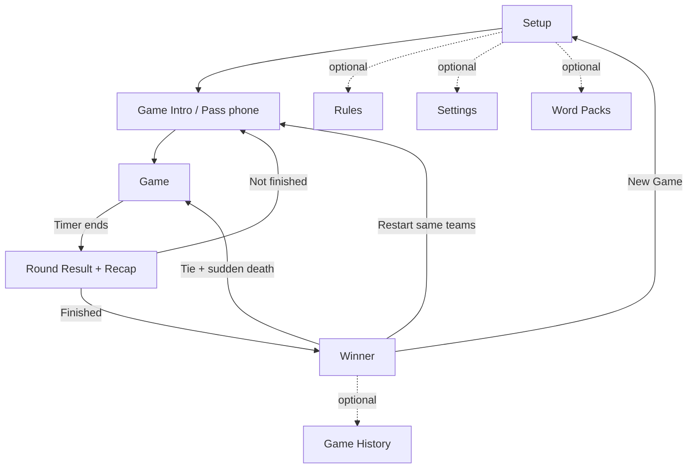

# Alias Game — Product & Screen Requirements (v2)

## Document purpose

This is a detailed product specification for the **Alias** word-guessing mobile game. It covers the game rules, the underlying data model, every screen (purpose, layout, states, interactions, validation, and edge cases), app lifecycle behavior, non-functional requirements, and a set of optional "headline" features.

**Platform & stack constraints (given):**

- React Native, **without Expo** (bare React Native CLI).
- UI built with **Gluestack UI** components, used consistently.
- **Offline-first**: the core game must work with no network connection.
- Single shared device, **pass-and-play** (one phone is passed around the group). Multi-device play is an optional later feature.

> Anything marked **(v1)**, **(v2)**, or **(v3)** indicates phased scope — see [Release roadmap](#release-roadmap). Anything marked **[Optional]** is nice-to-have within its phase.

---

## Table of contents

1. [Game concept](#1-game-concept)
2. [Terminology](#2-terminology)
3. [Game modes](#3-game-modes)
4. [Rules engine](#4-rules-engine) ← the part the original spec was missing
5. [Data model](#5-data-model)
6. [Screen requirements](#6-screen-requirements)
7. [Navigation flow](#7-navigation-flow)
8. [App lifecycle, timer & persistence](#8-app-lifecycle-timer--persistence)
9. [Creative & extraordinary features](#9-creative--extraordinary-features)
10. [Non-functional requirements](#10-non-functional-requirements)
11. [Sound & haptics](#11-sound--haptics)
12. [Word packs & content](#12-word-packs--content)
13. [Edge cases & error handling](#13-edge-cases--error-handling)
14. [Release roadmap](#14-release-roadmap)
15. [Open questions](#15-open-questions)

---

## 1. Game concept

Alias is a team word-guessing party game. On each turn, one player from the active team (the **describer**) sees a word and explains it to their teammates using synonyms, descriptions, and hints — **without saying the word, any part of it, or its direct translation**. Teammates (the **guessers**) try to say the word out loud. The describer marks each word **correct** or **skip** and moves to the next word, racing a countdown timer. Teams take turns; the winner is decided by score or by reaching a target, depending on the mode.

**Design goals**

- Fast, frictionless gameplay — large tap targets, instant word transitions, no fiddly menus mid-round.
- Fair and configurable rules that suit families, parties, and competitive players.
- Robust offline behavior, including a timer that never breaks when the app is interrupted.
- Accessible and localizable from day one.

**Non-goals (for the first version)**

- Online/remote multiplayer (optional v3).
- User accounts / cloud sync (local-only data).
- In-app purchases.

---

## 2. Terminology

| Term | Definition |
| --- | --- |
| **Active team** | The team currently taking its turn. |
| **Describer** | The player holding the device and explaining words. By default this is whoever holds the phone; the team rotates this informally. **[Optional]** track individual players for forced rotation and stats. |
| **Guessers** | The describer's teammates, trying to say the word. |
| **Word card** | A single word to be guessed, optionally with a list of forbidden related words (see [Taboo mode](#describe-modes-v2)). |
| **Round / Turn** | One team's single timed playing period. ("Round" and "turn" are used interchangeably; the UI uses **Round**.) |
| **Rotation** | One full cycle in which every team has played exactly one round. |
| **Round count** *(Time Score mode)* | The number of rounds **each team** plays. Total rounds = `roundCount × teamCount`. |
| **Score delta** | The net points a team gains or loses in a single round. |
| **Word pool** | The set of available words for the current game, drawn from the selected word pack(s). |

---

## 3. Game modes

The user picks one mode per game during Setup.

### 3.1 Time Score mode

- Each team plays a fixed **round count** (rounds per team).
- The game ends when every team has completed all of its rounds (the final rotation is finished).
- **Winner:** the team with the highest total score. Ties are resolved by the configured [tie-break](#46-end-of-game-fairness--tie-breaks).

### 3.2 Max Score mode

- The game ends when a team reaches or passes the configured **max score**.
- **Fairness option (recommended, configurable):** *Finish the rotation* — when a team hits the target, the current rotation completes so every team has played an equal number of rounds. The highest score after the rotation wins. If disabled, the **first** team to reach the target wins immediately.
- **Winner:** the team at or above the target with the highest score (after the optional equalizing rotation). Ties → [tie-break](#46-end-of-game-fairness--tie-breaks).

### 3.3 Describe modes (v2)

Independent of scoring mode, the group can choose **how** words are conveyed. Default is classic verbal description.

- **Describe** (default) — explain with words, no part of the target allowed.
- **Taboo** — each card lists 3–5 forbidden related words the describer also cannot say (richer, harder).
- **Charades** — act it out, no talking. **[Optional]**
- **One word** — exactly one word per clue.
- **Hum / sing** — for song/movie packs. **[Optional]**

Describe mode affects only how the round is presented; scoring, timer, and flow are unchanged.

---

## 4. Rules engine

This section defines the authoritative gameplay logic that all screens share.

### 4.1 Turn structure

1. The active team is shown the **Game Intro** (hand-off) screen.
2. On **Start Round**, the timer initializes and the first word is drawn from the pool.
3. The describer marks each word **Correct**, **Skip**, or **Foul** (if enabled); the next word is drawn immediately.
4. The round ends when the timer reaches zero (see [last-word rule](#44-timer--last-word-rule)) or, optionally, when a per-round skip limit forces an end.
5. The **Round Result** screen shows the summary; on **Continue**, the engine decides the next step (next team or Winner) per the active mode.

### 4.2 Scoring

For a single round:

```
roundDelta = (correctCount × correctScore)
           + (skipCount × skipScore)
           + (foulCount × foulScore)      // foul is optional

team.score += roundDelta
```

- `correctScore` is positive (default **+1**).
- `skipScore` is zero or negative (default **0**; common alt **−1**).
- `foulScore` **[Optional]** is zero or negative (default **−1**), applied when the describer breaks a rule.
- **Negative totals:** allowed by default. A "No negative scores" setting clamps `team.score` to a minimum of `0`.
- Scores update **immediately** in the UI on every action.

### 4.3 Word flow & repetition

- Words are drawn from a shuffled pool built from the selected pack(s).
- A word is **never repeated** while unused words remain in the current game.
- If the pool is **exhausted mid-game**, reshuffle all previously used words (excluding the word currently on screen) and continue.
- If a pack is very small, this guarantees play never stalls; show a non-blocking notice in Setup when the pool is unusually small relative to expected length.

### 4.4 Timer & last-word rule

- The timer counts down from `roundDurationSec` to zero and is the single source of round length.
- Configurable **buzzer-beater rule**:
  - **Hard stop** (default) — at zero, the current word is discarded with no points; inputs disable.
  - **Finish the word** — the describer gets one final decision on the word currently on screen after the buzzer, then the round ends.
- Visual + audio + haptic warning during the final 10 and 5 seconds (see [Sound & haptics](#11-sound--haptics)).
- **[Optional]** Pause control mid-round (e.g., interruption); paused time does not count down.

### 4.5 Skips & fouls

- **Skip** advances to the next word and applies `skipScore`.
- **[Optional] Skip limit** per round (`skipLimit`, default unlimited). When reached, the Skip button disables for the rest of the round.
- **[Optional] Foul** button applies `foulScore` and advances — used when the describer says a forbidden word. With **Auto-foul (v3)**, on-device speech recognition can flag the spoken target word automatically.

### 4.6 End-of-game, fairness & tie-breaks

- **Time Score:** game ends after the final rotation completes.
- **Max Score:** game ends when a team hits the target (immediately, or after the equalizing rotation if enabled).
- **Tie-break (configurable):**
  - **Show draw** (default for Time Score) — declare a tie and list co-leaders.
  - **Sudden-death lightning round** — tied teams play a short shared-timer round (e.g., 30s each, or a single golden word); highest delta wins. Repeat until broken.

### 4.7 Describer rotation [Optional, v2]

If individual players per team are tracked, the describer rotates each time the team plays so everyone describes roughly equally. Otherwise the team manages this informally and the app only tracks team-level state.

---

## 5. Data model

A suggested shape for the core entities and persisted session. (Field names are illustrative.)

```ts
type GameMode = 'time' | 'max';
type DescribeMode = 'describe' | 'taboo' | 'charades' | 'oneWord' | 'hum';
type TieBreak = 'draw' | 'suddenDeath';
type BuzzerRule = 'hardStop' | 'finishWord';

interface GameConfig {
  mode: GameMode;
  describeMode: DescribeMode;       // v2; default 'describe'
  roundDurationSec: number;         // > 0
  correctScore: number;             // != 0, positive
  skipScore: number;                // <= 0
  foulScore?: number;               // <= 0 (optional)
  maxScore?: number;                // required when mode === 'max'
  roundCount?: number;              // required when mode === 'time' (rounds per team)
  skipLimit?: number;               // optional; undefined = unlimited
  allowNegativeTotals: boolean;     // default true
  buzzerRule: BuzzerRule;           // default 'hardStop'
  finishRotationOnMax: boolean;     // Max mode fairness; default true
  tieBreak: TieBreak;
  wordPackIds: string[];            // selected packs; falls back to default
  contentFilter: 'kids' | 'standard' | 'adult';
}

interface Team {
  id: string;
  name: string;
  color: string;                    // theme-safe team color
  avatar?: string;                  // optional emoji/icon
  score: number;
  roundsPlayed: number;
  totalCorrect: number;
  totalSkipped: number;
  totalFouls: number;
}

interface RoundResult {
  teamId: string;
  index: number;                    // which round for this team (0-based)
  correctWordIds: string[];
  skippedWordIds: string[];
  fouledWordIds: string[];
  scoreDelta: number;
  durationUsedSec: number;
}

interface WordCard {
  id: string;
  word: string;
  packId: string;
  difficulty: 'easy' | 'medium' | 'hard';
  taboo?: string[];                 // forbidden related words (Taboo mode)
  locale: string;                   // e.g. 'en', 'es'
}

type GameStatus = 'setup' | 'intro' | 'playing' | 'roundResult' | 'finished';

interface GameSession {
  config: GameConfig;
  teams: Team[];
  rounds: RoundResult[];
  currentTeamIndex: number;
  usedWordIds: string[];
  wordQueue: string[];              // upcoming shuffled word ids
  roundEndTimestamp?: number;       // epoch ms; timer source of truth
  status: GameStatus;
  winnerTeamIds: string[];          // 1 winner, or multiple on draw
  createdAt: number;
  updatedAt: number;
}
```

The full `GameSession` is persisted on every meaningful state change so a game can be resumed after the app is closed (see [Persistence](#8-app-lifecycle-timer--persistence)).

---

## 6. Screen requirements

Core screens (first version): **Setup → Game Intro → Game → Round Result → Winner**.
Optional screens: **Rules, Settings, Word Packs, Stats & Achievements, Game History, Multiplayer Lobby**.

### 6.1 Setup Screen

**Purpose.** First screen on launch. Configure teams, mode, scoring, and finish conditions, then start the game.

**Layout & components (Gluestack):** scrollable form with sections — Teams, Game mode, Describe mode (v2), Timer & scoring, Finish condition, Word packs, and a sticky **Start Game** button at the bottom.

**Teams**

- List of editable team rows, each with a name `Input`, a color/avatar picker **[Optional]**, and a remove control.
- **Add team** button. Minimum **2**, maximum **8** teams (configurable cap).
- Names are trimmed; duplicates are allowed but show a soft warning; max length ~20 chars (truncate elsewhere).

**Game mode** — segmented control / toggle between **Time Score** and **Max Score**, with a one-line explanation of each.

**Describe mode (v2)** — selector for Describe / Taboo / One word / (Charades, Hum).

**Timer & scoring**

- Round duration `Slider`/stepper (range **15–300s**, default **60**).
- Correct answer score (range **1–10**, default **1**).
- Skip word score (range **−5–0**, default **0**).
- Foul score **[Optional]** (range **−5–0**, default **−1**).
- Skip limit **[Optional]** (toggle + stepper).

**Finish condition (mode-dependent)**

- **Time Score** → show **Round count** (rounds per team; range **1–20**, default **3**).
- **Max Score** → show **Max score** (range **10–200**, default **30**) and the **Finish the rotation** fairness toggle.

**Word packs** — entry point to select packs / open the Word Pack screen; defaults to the bundled standard pack. Content filter selector (Kids / Standard / Adult).

**Presets [Optional, v1]** — quick "Family / Party / Hardcore / Kids" buttons that fill all settings at once.

**Validation (must pass before Start enables):**

- At least 2 teams; every team name non-empty after trim.
- Round duration > 0.
- Correct score ≠ 0.
- Skip score is a valid number ≤ 0.
- Foul score (if enabled) is a valid number ≤ 0.
- Max Score mode → max score present and within range.
- Time Score mode → round count present and ≥ 1.
- Selected packs contain at least 1 usable word for the chosen content filter/locale.

**UI behavior**

- **Start Game** is disabled while invalid; inline messages explain each failing field. Optionally allow tapping a disabled button to reveal all errors at once.
- Settings persist as the user's defaults for next time **[Optional]**.

**Edge cases:** duplicate names, only 1 team, empty names, pool too small for chosen length, switching modes preserves shared fields and resets mode-specific ones.

---

### 6.2 Game Intro Screen (hand-off)

**Purpose.** Shown before each round to hand the device to the next team and prepare players.

**Must show**

- **Current team name** — the dominant visual element (large, team color).
- Current team **score**.
- Round info:
  - Time Score → "Round X of N".
  - Max Score → "Score: current / target".
- Describe mode reminder (v2) and a one-line "how to" if Taboo/Charades.
- Large **Start Round** button.

**Pass-the-phone UX [Optional, v1]** — a clear "Pass the phone to **{team}**" framing, optionally requiring a deliberate tap/long-press to reveal the start control so the previous describer can't peek at the next word.

**Start Round behavior** — initialize timer, set `roundEndTimestamp`, draw the first word, navigate to the Game Screen.

**Secondary actions [Optional]** — Restart game / Back to setup, each behind a confirmation dialog (`AlertDialog`) to prevent accidental loss.

---

### 6.3 Game Screen (gameplay)

**Purpose.** The core loop: show a word, mark correct/skip/foul, beat the clock.

**Must show**

- Active **team name** (compact, top).
- **Timer** — prominent at the top; counts down to zero with a clear last-10s state.
- **Current word** — centered, large, highly legible; exactly one word visible at a time. In Taboo mode, show the forbidden list beneath in smaller text.
- **Correct** and **Skip** buttons — large, thumb-reachable, clearly distinct (color + icon + haptic).
- **[Optional] Foul** button.
- **Round score** (this round's delta) and **total team score**, both updating instantly.
- **[Optional]** Words-remaining or skip-remaining indicator.

**Layout guidance**

- Buttons sized for fast, eyes-on-the-word tapping; consider bottom placement and a **left-/right-handed** layout option.
- Use color + icon (not color alone) to distinguish Correct vs Skip for colorblind users.

**Correct action** — apply `correctScore`, increment round correct count, mark word used, advance to next word. Light success haptic + sound.

**Skip action** — apply `skipScore`, increment round skip count, mark word used, advance. Respect skip limit if set. Selection haptic + sound.

**Foul action [Optional]** — apply `foulScore`, mark word used (or keep, configurable), advance. Warning haptic + buzzer.

**Mis-tap protection** — debounce rapid double-taps; provide a small **Undo last** affordance that reverts the most recent correct/skip/foul and restores the previous word.

**Round end** — when the timer hits zero (respecting the [buzzer rule](#44-timer--last-word-rule)): stop the timer, disable all action buttons, persist the `RoundResult`, then navigate to the Round Result screen. Times-up buzzer + heavy haptic.

**Backgrounding** — see [Lifecycle](#8-app-lifecycle-timer--persistence): pause safely, never double-count or drift, resume in a paused state.

**Android hardware back / gesture** — confirm before exiting an active round.

---

### 6.4 Round Result Screen

**Purpose.** Summarize the round and route to the next step.

**Must show**

- Team name and color.
- **Correct count**, **skipped count**, **[Optional] foul count**.
- **Score change** for the round (signed) and the **new total**.
- **Continue** button.

**Word recap [Optional, v1]** — a scrollable list of every word from the round tagged Correct / Skipped / Foul.

**Challenge / contest a call [Optional, v2]** — from the recap, the group can flip a word's outcome (e.g., a guesser disputes a "correct"). The score recalculates from the per-word records — never from a running counter — so corrections are always consistent.

**Continue behavior** — the engine evaluates end-of-game conditions for the active mode:

- **Max Score:** if the team reached/passed `maxScore` (and the equalizing rotation, if enabled, is complete) → Winner Screen. Otherwise advance `currentTeamIndex` to the next team → Game Intro.
- **Time Score:** if all teams completed `roundCount` rounds → Winner Screen. Otherwise advance to the next team → Game Intro.

**Secondary actions [Optional]** — Restart game behind a confirmation dialog.

---

### 6.5 Winner Screen

**Purpose.** Celebrate the result and offer next steps.

**Must show**

- **Winner team name** — large and celebratory (confetti / animation), in team color.
- **Draw state** when top scores tie (primarily Time Score): clearly indicate a tie and list co-leaders. If `tieBreak = suddenDeath`, route into a tie-break round instead of declaring a draw.
- **Final scoreboard** — all teams ordered highest → lowest, with scores and key stats (correct/skipped).
- **Total rounds played**.
- **Restart Game** and **New Game** buttons.

**Share results [Optional, v1]** — generate a shareable scoreboard image/card (team colors, final scores, mode, date) via the OS share sheet.

**Restart Game behavior** — replay with the **same teams and settings**; reset team scores, round results, used words, `currentTeamIndex`, timer, and winner state; navigate to Game Intro for the first team.

**New Game behavior** — return to the Setup Screen for a fresh configuration.

---

### 6.6 Optional screens

**Rules Screen [v1].** Plain-language explanation: how to play, what Correct/Skip/Foul mean, how each mode works, how scoring works, how the game ends, and a short note per describe mode. Scrollable, readable, accessible.

**Settings Screen [v1].** Sound on/off, vibration/haptics on/off, theme (light/dark/system), high-contrast & large-text toggles, language, left-/right-handed layout, default round duration and default scoring. Settings persist across launches and respect OS-level reduce-motion/silent settings.

**Word Pack Screen [v1+].** Browse and select built-in packs; create/edit/delete custom packs; filter by difficulty and content rating. Examples: Easy / Medium / Hard, Movies, Animals, Sports, Technology, Food, Travel, Kids, plus seasonal packs (Halloween, Holidays). The selected pack(s) are used in-game; with none selected, fall back to the default. **AI-generated packs [v2]** — see [Creative features](#92-ai-generated-word-packs-v2).

**Stats & Achievements Screen [v2].** Local, per-device records: most words in a round, longest streak, fastest average, games played, win counts by team name. Achievements/badges for milestones. No accounts required.

**Game History Screen [Optional].** List of completed games: date, teams, winner, final scores, mode, round count / max score. Tap to view a full breakdown. Option to clear history.

**Multiplayer Lobby [v3].** Create/join a local-network or Bluetooth room; each phone becomes a buzzer/guesser device while one shows the word. See [Local multiplayer](#95-local-multiplayer-v3).

---

## 7. Navigation flow

```
Setup → Game Intro → Game → Round Result →
        ├─ (game not finished) → Game Intro (next team)
        └─ (game finished)     → Winner
Winner → Restart (same teams) → Game Intro
       → New Game → Setup
```



Optional screens (Rules, Settings, Word Packs, Stats, History) are reachable from Setup and/or a top-bar menu and return to their entry point.

---

## 8. App lifecycle, timer & persistence

**Timer correctness (critical).** Drive the round length from an absolute timestamp, not from accumulated intervals:

- On round start, store `roundEndTimestamp = now + roundDurationSec × 1000`.
- A single UI ticker computes `remaining = roundEndTimestamp − now` each frame/second. This prevents drift, duplication, and the "two timers running" class of bugs.

**Backgrounding (active round).** Use `AppState`:

- On background, capture remaining time and **pause** (stop the visible countdown).
- On foreground, show a **Paused** overlay; do **not** auto-resume. The user taps to continue, at which point `roundEndTimestamp` is recomputed from the remaining time. The timer must never continue counting "in the background," double-fire end-of-round, or jump.

**App killed mid-round.** The session is persisted, so on next launch offer **Resume game** (re-enter the paused round) or **Discard** — configurable to instead **forfeit** the interrupted round.

**Persistence layer.** Persist `GameSession` on every meaningful change using fast local storage (e.g., MMKV or AsyncStorage). On launch, if an in-progress session exists, present a **Resume / New game** choice on the Setup Screen. Settings and stats persist independently.

**Cleanup.** Clear timers and listeners on unmount and on leaving the Game Screen to avoid leaks and stray callbacks.

---

## 9. Creative & extraordinary features

A menu of distinctive features beyond the core game. Prioritized into headline (high impact) and supporting ideas. Several need specific native modules — noted inline — which matters since the app is bare React Native.

### 9.1 Tilt-to-Play mode (v2) — *headline*

A "phone on the forehead" mode (like Heads Up): the describer holds the device facing the guessers and **tilts down = Correct**, **tilts up = Skip**. Hands-free, hilarious, and very shareable.

- Uses the accelerometer/gyroscope (`react-native-sensors` or similar native module).
- Calibrate a neutral position; debounce so a single tilt isn't read twice; require returning to neutral between actions.
- Big, glanceable color flashes (green/red) confirm each action; pairs perfectly with Charades.

### 9.2 AI-generated word packs (v2) — *headline*

Let players generate a custom pack on any theme — "90s cartoons," "our office inside jokes," "kitchen utensils" — and optionally auto-fill Taboo forbidden words and difficulty.

- Generates a `WordCard[]` (word + difficulty + optional taboo list) for the chosen theme and locale.
- Requires network at generation time; generated packs are cached locally and play fully offline afterward.
- Include a content filter so kid-safe packs stay clean; let users review/edit before saving.

### 9.3 Buzz-in steals (v2) — *headline*

Keep idle teams engaged: when the active team **skips** (or fouls), opposing teams may "buzz in" to steal the word for reduced points (e.g., half). On a single device this is a quick "Steal? → which team" prompt; on multi-device it's a real race.

- Configurable: steal on skip only, on foul only, or both; steal value; one steal per word.
- Turns the dead time other teams spend watching into active play.

### 9.4 Power-ups & wildcards (v2)

Occasional collectible boosts that add light strategy:

- **Double points** (next correct or next 10 seconds), **Time freeze** (pause the clock briefly), **Skip shield** (one free, penalty-less skip), **Steal block** (opponents can't steal this round).
- Earned via streaks/achievements or dealt randomly at round start. Fully optional toggle for purists.

### 9.5 Streaks, combos & the Golden Word (v1–v2)

- Consecutive corrects build a visible **combo multiplier** (resets on skip), rewarding fast play.
- A random **Golden Word** appears mid-round with special styling, worth bonus points.
- Cheap to build, big on excitement and replayability.

### 9.6 Wager / bluff round (v2)

Before a round, the team **wagers** how many words they'll get; hit or beat it for a bonus, miss it for a small penalty. Adds tension and self-handicapping for stronger players.

### 9.7 Local multiplayer (v3) — *headline*

Each player uses their own phone over the same Wi-Fi network or Bluetooth: one device shows the word to the describer, others act as buzzers/guessers, and a shared scoreboard syncs in real time. Optionally **cast the scoreboard to a TV**.

- Needs a local transport (e.g., a multipeer/Nearby-style native module or a small LAN socket layer). No central server required for LAN play.

### 9.8 Handicap & balancing (v1)

Per-team adjustments so mixed groups (kids vs adults, beginners vs pros) stay fun: longer timer, easier pack, or a points multiplier for chosen teams. Set in Setup.

### 9.9 Accessibility-first extras (v1)

- **Colorblind-safe** palettes and icon-plus-color action buttons.
- **Large-text** and high-contrast modes.
- **Left-/right-handed** button layout.
- **Audio describer mode [Optional]** — the device reads the word aloud through earphones (so guessers don't hear) for low-vision describers, using on-device TTS.

### 9.10 Theming & team identity (v1)

Per-team colors, emoji/icon avatars, and optional custom team "win sounds." A few app-wide themes (and a fun "party" animated theme). Confetti and celebratory animations on the Winner screen.

### 9.11 Auto-foul detection (v3) — *experimental*

On-device speech recognition listens for the forbidden target (and Taboo) words and auto-flags a foul. Privacy-sensitive (microphone, on-device only) and locale-dependent — strictly opt-in and clearly disclosed.

---

## 10. Non-functional requirements

- **Offline-first.** Core gameplay requires no network. Only optional features (AI packs, online play) use connectivity.
- **Performance.** Word transitions and score updates feel instant (<100ms); animations target 60fps (use `react-native-reanimated`); no jank when tapping Correct/Skip rapidly.
- **Orientation.** Gameplay is **portrait-locked** for one-handed pass-and-play. (Landscape/tablet layouts optional later.)
- **Platforms (assumed; confirm).** iOS 15+ and Android 8.0 / API 26+.
- **Theming.** Light / dark / system, plus high-contrast.
- **Internationalization.** All UI strings externalized; **RTL** support; per-locale word packs and number/format handling.
- **Privacy.** No accounts or PII; all game data, stats, and history stored locally. Any analytics are opt-in and anonymous.
- **Resilience.** No crash or data loss on interruption (call, background, kill); always resumable or cleanly recoverable.
- **App size.** Keep bundled assets lean; word packs are compact JSON.

---

## 11. Sound & haptics

Distinct, configurable feedback for each event; respect OS silent mode and reduce-motion/haptics settings, and the in-app Sound/Vibration toggles.

| Event | Sound | Haptic |
| --- | --- | --- |
| Correct | Pleasant ding | Light success |
| Skip | Soft whoosh | Selection |
| Foul | Buzzer | Warning |
| Last 10s / 5s | Subtle accelerating tick | Escalating light pulses |
| Time's up | Round-end buzzer | Heavy impact |
| Combo / Golden word | Sparkle / chime | Medium |
| Game won | Fanfare + confetti | Celebration pattern |

---

## 12. Word packs & content

- **Format.** Packs are compact JSON arrays of `WordCard` objects (`word`, `difficulty`, optional `taboo`, `locale`). Built-in packs ship with the app; custom and AI-generated packs are stored locally.
- **Selection.** One or more packs per game; with none selected, use the default pack.
- **Filtering.** Content rating (Kids / Standard / Adult) filters the pool; difficulty can be mixed or constrained.
- **Localization.** Packs are per-locale; the active language selects matching packs and UI strings.
- **Quality rules.** Words are appropriate for the rating; Taboo lists contain genuinely related, non-trivial forbidden words; avoid near-duplicates and proper nouns in the default pack.

---

## 13. Edge cases & error handling

- Fewer than 2 teams, empty or whitespace-only names, duplicate names (soft warning).
- Word pool exhausted mid-game → reshuffle used words (excluding current) and continue seamlessly.
- Pack smaller than expected round length → still playable via reshuffle; show a Setup notice if unusually small.
- No pack selected / missing or empty pack file → fall back to default and surface a friendly error.
- Timer hits zero with a word on screen → apply the configured buzzer rule (hard stop vs finish the word).
- Rapid double-taps on action buttons → debounced; **Undo last** reverts the most recent action.
- App backgrounded mid-round → pause safely; resume in paused state; never drift or double-count.
- App killed mid-round → offer Resume or Discard/forfeit on next launch.
- Multiple teams reach Max Score in the same equalizing rotation → tie-break.
- Time Score ends level → show draw or sudden-death per setting.
- Negative totals → allowed, or clamped to 0 per setting.
- Android hardware back / exit gesture during active round → confirm before leaving.
- Very long team names / max teams → ellipsis + scrolling; layouts never overflow.
- Restart / New Game / Back to setup → always behind a confirmation when a game is in progress.
- Device rotation or theme change mid-game → state preserved.

---

## 14. Release roadmap

**MVP (v0)** — the five core screens; Time Score + Max Score; correct/skip scoring; default word pack; robust timer + background/kill handling and resume; basic haptics; validation.

**v1** — Rules & Settings screens; word-pack selection; round recap; share results card; rule presets; handicap/balancing; themes & team colors; accessibility pass; full sound design.

**v2** — Tilt-to-Play; describe modes (Taboo, Charades, One word, Hum); buzz-in steals; power-ups; streaks/combos & Golden Word; wager round; AI-generated packs; Stats & Achievements; challenge-a-call recap.

**v3** — Local multiplayer + cast to TV; auto-foul speech detection; optional online play.

---

## 15. Open questions

1. **Players within teams** — track individual players (forced describer rotation, per-player stats) or stay team-level only?
2. **Negative scores** — allow them, or clamp to zero by default?
3. **Max Score fairness** — confirm "finish the rotation" (equalizing) as the default.
4. **Tie-break** — preferred default (draw vs sudden-death) per mode?
5. **Platform minimums** — confirm iOS / Android version targets.
6. **Native modules** — are sensors (tilt), speech recognition (auto-foul), and a LAN/Bluetooth transport (multiplayer) acceptable to add?
7. **AI packs** — generation provider, network/privacy expectations, and whether they ship in v2 or later.
8. **Online multiplayer** — in scope at all? If so, it implies a backend and changes the architecture.
